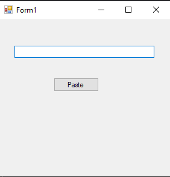
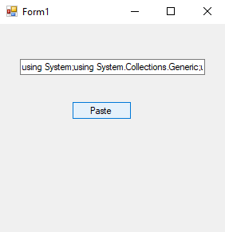
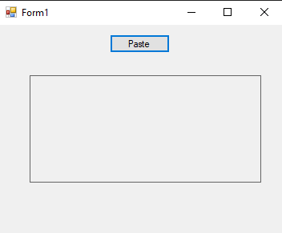
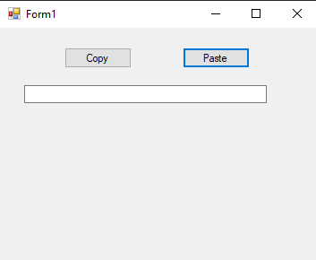
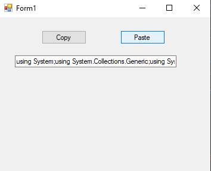
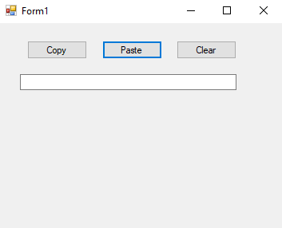
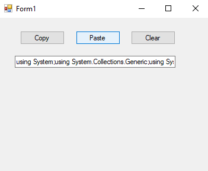

# 63-clipboard Snippets Code

## 1-get-text example

### Program.cs

```c#
using System;
using System.Collections.Generic;
using System.ComponentModel;
using System.Data;
using System.Drawing;
using System.Linq;
using System.Text;
using System.Threading.Tasks;
using System.Windows.Forms;

namespace clip
{
    public partial class Form1 : Form
    {
        public Form1()
        {
            InitializeComponent();
        }

        private void button1_Click(object sender, EventArgs e)
        {
            textBox1.Text = Clipboard.GetText();
            //GetText is right equal to paste.
        }
    }
}


```

### Ouput





## 2-get-image example

### Program.cs

```c#
using System;
using System.Collections.Generic;
using System.ComponentModel;
using System.Data;
using System.Drawing;
using System.Linq;
using System.Text;
using System.Threading.Tasks;
using System.Windows.Forms;

namespace getimg
{
    public partial class Form1 : Form
    {
        public Form1()
        {
            InitializeComponent();
        }

        private void Form1_Load(object sender, EventArgs e)
        {

        }

        private void button1_Click(object sender, EventArgs e)
        {
            pictureBox1.Image = Clipboard.GetImage();
        }
    }
}

//we can copy images from html and paste them.

```

### Ouput




## 3-set-text example

### Program.cs

```c#

using System;
using System.Collections.Generic;
using System.ComponentModel;
using System.Data;
using System.Drawing;
using System.Linq;
using System.Text;
using System.Threading.Tasks;
using System.Windows.Forms;

namespace getimg
{
    public partial class Form1 : Form
    {
        public Form1()
        {
            InitializeComponent();
        }

        private void Form1_Load(object sender, EventArgs e)
        {

        }

        private void button1_Click(object sender, EventArgs e)
        {
            textBox1.Text = Clipboard.GetText();
        }

        private void button2_Click(object sender, EventArgs e)
        {
           
                Clipboard.SetText("guna");
            
        }
    }
}

//The SetText is right equal to copy.


```

### Ouput




## 4-clear example

### Program.cs

```c#
using System;
using System.Collections.Generic;
using System.ComponentModel;
using System.Data;
using System.Drawing;
using System.Linq;
using System.Text;
using System.Threading.Tasks;
using System.Windows.Forms;

namespace getimg
{
    public partial class Form1 : Form
    {
        public Form1()
        {
            InitializeComponent();
        }

        private void Form1_Load(object sender, EventArgs e)
        {

        }

        private void button1_Click(object sender, EventArgs e)
        {
            textBox1.Text = Clipboard.GetText();
        }

        private void button2_Click(object sender, EventArgs e)
        {
           
                Clipboard.SetText("guna");
            
        }

        private void button3_Click(object sender, EventArgs e)
        {
            Clipboard.Clear();//will clear the Board.
        }
    }
}

//The SetText is right equal to copy.

```

### Ouput





