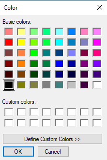
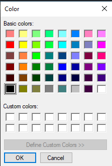
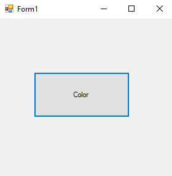
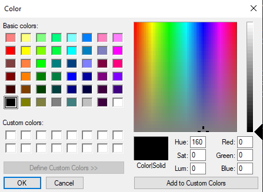
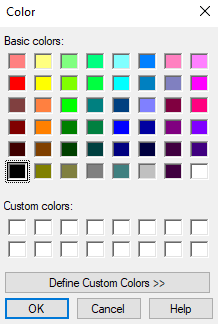

# 64-color-dialog Snippets Code

## 1-example

### Program.cs

```c#
using System;
using System.Collections.Generic;
using System.ComponentModel;
using System.Data;
using System.Drawing;
using System.Linq;
using System.Text;
using System.Threading.Tasks;
using System.Windows.Forms;

namespace ColorDia
{
    public partial class Form1 : Form
    {
        public Form1()
        {
            InitializeComponent();
        }

        private void button1_Click(object sender, EventArgs e)
        {
            ColorDialog cd=new ColorDialog();
            
            if (cd.ShowDialog() == DialogResult.OK) {

                button1.BackColor = cd.Color;

            }

        }
    }
}

```

### Ouput





## 2-allow-full-open example

### Program.cs

```c#
using System;
using System.Collections.Generic;
using System.ComponentModel;
using System.Data;
using System.Drawing;
using System.Linq;
using System.Text;
using System.Threading.Tasks;
using System.Windows.Forms;

namespace ColorDia
{
    public partial class Form1 : Form
    {
        public Form1()
        {
            InitializeComponent();
        }

        private void button1_Click(object sender, EventArgs e)
        {
            ColorDialog cd=new ColorDialog();
            cd.AllowFullOpen = false;//User can't create custom colors.
            
            if (cd.ShowDialog() == DialogResult.OK) {

                button1.BackColor = cd.Color;

            }

        }
    }
}


```

### Ouput





## 3-full-open example

### Program.cs

```c#
using System;
using System.Collections.Generic;
using System.ComponentModel;
using System.Data;
using System.Drawing;
using System.Linq;
using System.Text;
using System.Threading.Tasks;
using System.Windows.Forms;

namespace ColorDia
{
    public partial class Form1 : Form
    {
        public Form1()
        {
            InitializeComponent();
        }

        private void button1_Click(object sender, EventArgs e)
        {
            ColorDialog cd=new ColorDialog();
            cd.FullOpen = true;//The Color plate will be full open.
            
            if (cd.ShowDialog() == DialogResult.OK) {

                button1.BackColor = cd.Color;

            }

        }
    }
}


```

### Ouput




## 4-show-help example

### Program.cs

```c#
using System;
using System.Collections.Generic;
using System.ComponentModel;
using System.Data;
using System.Drawing;
using System.Linq;
using System.Text;
using System.Threading.Tasks;
using System.Windows.Forms;

namespace ColorDia
{
    public partial class Form1 : Form
    {
        public Form1()
        {
            InitializeComponent();
        }

        private void button1_Click(object sender, EventArgs e)
        {
            ColorDialog cd=new ColorDialog();
            cd.ShowHelp = true;
            cd.HelpRequest += Cd_HelpRequest;
            
            if (cd.ShowDialog() == DialogResult.OK) {

                button1.BackColor = cd.Color;

            }

        }

        private void Cd_HelpRequest(object sender, EventArgs e)
        {
            MessageBox.Show("This is Help");
        }
    }
}


```

### Ouput





