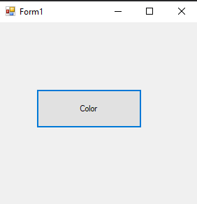
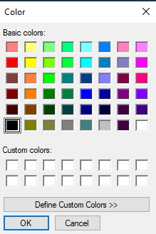
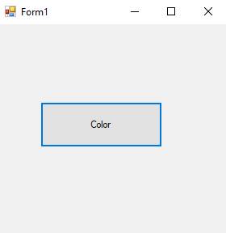
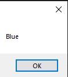
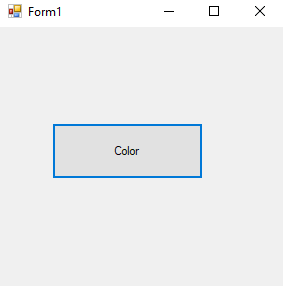
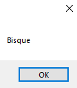
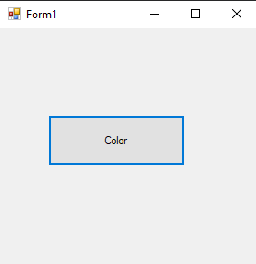
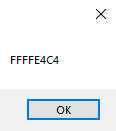
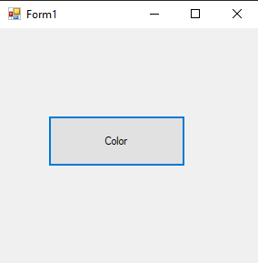
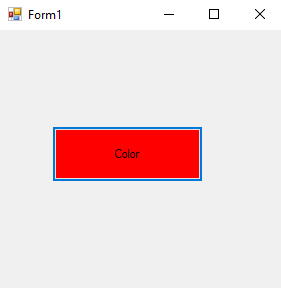

# 65-color-struct Snippets Code

## 1-is-named-color example

### Program.cs

```c#
using System;
using System.Collections.Generic;
using System.ComponentModel;
using System.Data;
using System.Drawing;
using System.Linq;
using System.Text;
using System.Threading.Tasks;
using System.Windows.Forms;

namespace ColorSs
{
    public partial class Form1 : Form
    {
        public Form1()
        {
            InitializeComponent();
        }

        private void button1_Click(object sender, EventArgs e)
        {

            ColorDialog cd = new ColorDialog();

            if (cd.ShowDialog() == DialogResult.OK) {

                Color c = cd.Color;

                if (c.IsNamedColor) {

                    MessageBox.Show(c.Name);
                }

            }

        }
    }
}
//The IsNamedColor returns weather the color has name or not.


```

### Ouput


## 2-is-known-color example

### Program.cs

```c#

using System;
using System.Collections.Generic;
using System.ComponentModel;
using System.Data;
using System.Drawing;
using System.Linq;
using System.Text;
using System.Threading.Tasks;
using System.Windows.Forms;

namespace ColorSs
{
    public partial class Form1 : Form
    {
        public Form1()
        {
            InitializeComponent();
        }

        private void button1_Click(object sender, EventArgs e)
        {

            ColorDialog cd = new ColorDialog();

            if (cd.ShowDialog() == DialogResult.OK) {

                Color c = cd.Color;

                if (c.IsKnownColor) {

                    MessageBox.Show(c.Name);
                }

            }

        }
    }
}
//IsNamedColor vs IsKnownColor
//IsKnownColor is colors which are used by windows such as scroll bar color and more.

```

### Ouput





## 3-color-class example

### Program.cs

```c#
using System;
using System.Collections.Generic;
using System.ComponentModel;
using System.Data;
using System.Drawing;
using System.Linq;
using System.Text;
using System.Threading.Tasks;
using System.Windows.Forms;

namespace ColorSs
{
    public partial class Form1 : Form
    {
        public Form1()
        {
            InitializeComponent();
        }

        private void button1_Click(object sender, EventArgs e)
        {

            Color c = Color.Blue;
            MessageBox.Show(c.Name);

        }
    }
}
//The Color Class has all the colors.


```

### Ouput




## 4-color-class-more example

### Program.cs

```c#

using System;
using System.Collections.Generic;
using System.ComponentModel;
using System.Data;
using System.Drawing;
using System.Linq;
using System.Text;
using System.Threading.Tasks;
using System.Windows.Forms;

namespace ColorSs
{
    public partial class Form1 : Form
    {
        public Form1()
        {
            InitializeComponent();
        }

        private void button1_Click(object sender, EventArgs e)
        {

            Color c = Color.FromKnownColor(KnownColor.Bisque);
            MessageBox.Show(c.ToKnownColor().ToString());

        }
    }
}
//we can also access the IsNamedColor like this.


```

### Ouput





## 5-to-argb example

### Program.cs

```c#
using System;
using System.Collections.Generic;
using System.ComponentModel;
using System.Data;
using System.Drawing;
using System.Linq;
using System.Text;
using System.Threading.Tasks;
using System.Windows.Forms;

namespace ColorSs
{
    public partial class Form1 : Form
    {
        public Form1()
        {
            InitializeComponent();
        }

        private void button1_Click(object sender, EventArgs e)
        {

            Color c = Color.FromKnownColor(KnownColor.Bisque);
            MessageBox.Show(c.ToArgb().ToString("X"));

        }
    }
}
//This will returns the color in the byte format;

```

### Ouput




## 6-color-conversion example

### Program.cs

```c#

using System;
using System.Collections.Generic;
using System.ComponentModel;
using System.Data;
using System.Drawing;
using System.Linq;
using System.Text;
using System.Threading.Tasks;
using System.Windows.Forms;

namespace ColorSs
{
    public partial class Form1 : Form
    {
        public Form1()
        {
            InitializeComponent();
        }

        private void button1_Click(object sender, EventArgs e)
        {


            Color c = Color.Red;
            int i = c.ToArgb();//This will convert the color into decimal format.
            Color b = Color.FromArgb(i);//here we convert the decimal color into color format.
            button1.BackColor = b;

        }
    }
}
//This will returns the color in the byte format;
```

### Ouput


