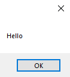
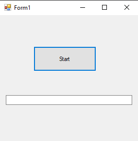
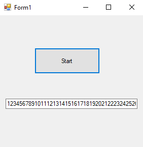

# 67-timeer Snippets Code

## 1- example

### Program.cs

```c#

using System;
using System.Collections.Generic;
using System.ComponentModel;
using System.Data;
using System.Drawing;
using System.Linq;
using System.Text;
using System.Threading.Tasks;
using System.Windows.Forms;

namespace TimerCon
{
    public partial class Form1 : Form
    {
        public Form1()
        {
            InitializeComponent();
        }

        private void button1_Click(object sender, EventArgs e)
        {
            timer1.Start();
        }

        private void timer1_Tick(object sender, EventArgs e)
        {
            timer1.Stop();
            MessageBox.Show("Hello");
           
        }
        
    }
}


//if we don't stop the timer this will continuely returns the MSG box.

```

### Ouput




## 2-advanced example

### Program.cs

```c#
using System;
using System.Collections.Generic;
using System.ComponentModel;
using System.Data;
using System.Drawing;
using System.Linq;
using System.Text;
using System.Threading.Tasks;
using System.Windows.Forms;

namespace TimerCon
{
    public partial class Form1 : Form
    {
        public Form1()
        {
            InitializeComponent();
        }
        int i = 0;

        private void button1_Click(object sender, EventArgs e)
        {
            timer1.Start();
        }

        private void timer1_Tick(object sender, EventArgs e)
        {

            i++;
            textBox1.Text += i.ToString();
           
        }
        
    }
}


```

### Ouput





