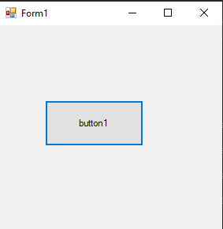
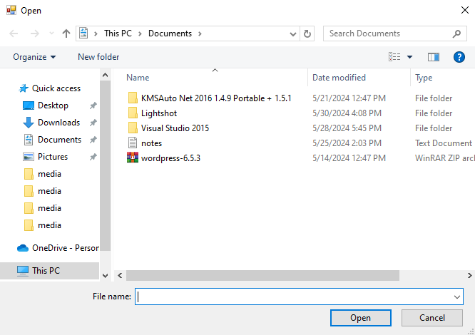
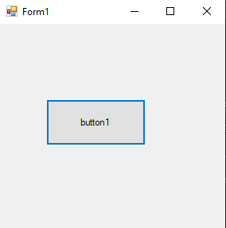
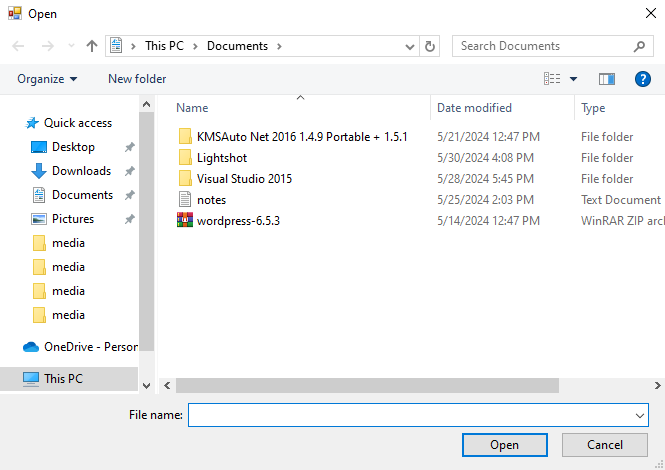
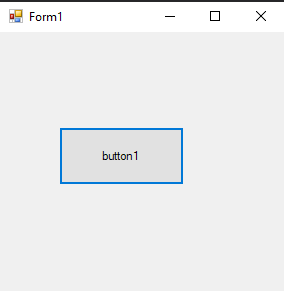
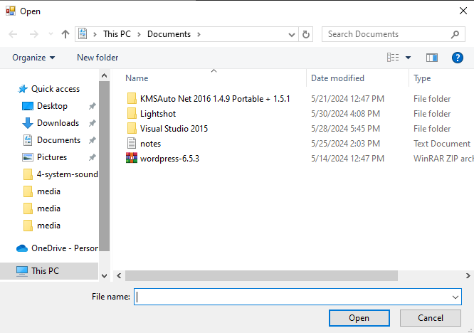
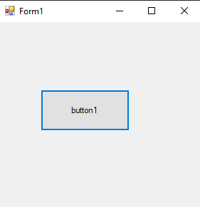

# 68-wav-player Snippets Code

## 1-play example

### Program.cs

```c#
using System;
using System.Collections.Generic;
using System.ComponentModel;
using System.Data;
using System.Drawing;
using System.Linq;
using System.Text;
using System.Threading.Tasks;
using System.Windows.Forms;
using System.Media;

namespace pla
{
    public partial class Form1 : Form
    {
        public Form1()
        {
            InitializeComponent();
        }

        private void button1_Click(object sender, EventArgs e)
        {
            OpenFileDialog o = new OpenFileDialog();

            if (o.ShowDialog() == DialogResult.OK) {

                SoundPlayer s = new SoundPlayer(o.FileName);

                s.Play();

            }
        }
    }
}

//This player can only play wav files.

```

### Ouput




## 2-play-looping example

### Program.cs

```c#
using System;
using System.Collections.Generic;
using System.ComponentModel;
using System.Data;
using System.Drawing;
using System.Linq;
using System.Text;
using System.Threading.Tasks;
using System.Windows.Forms;
using System.Media;

namespace pla
{
    public partial class Form1 : Form
    {
        public Form1()
        {
            InitializeComponent();
        }

        private void button1_Click(object sender, EventArgs e)
        {
            OpenFileDialog o = new OpenFileDialog();

            if (o.ShowDialog() == DialogResult.OK) {

                SoundPlayer s = new SoundPlayer(o.FileName);

                s.PlayLooping();

            }
        }
    }
}

//PlayLooping will play the sound again and again.This will  not stop.


```

### Ouput





## 3-play-sync example

### Program.cs

```c#
using System;
using System.Collections.Generic;
using System.ComponentModel;
using System.Data;
using System.Drawing;
using System.Linq;
using System.Text;
using System.Threading.Tasks;
using System.Windows.Forms;
using System.Media;

namespace pla
{
    public partial class Form1 : Form
    {
        public Form1()
        {
            InitializeComponent();
        }

        private void button1_Click(object sender, EventArgs e)
        {
            OpenFileDialog o = new OpenFileDialog();

            if (o.ShowDialog() == DialogResult.OK) {

                SoundPlayer s = new SoundPlayer(o.FileName);

                s.PlaySync();

            }
        }
    }
}

//PlaySync when it is playing the audio the program will frease the program.

```

### Ouput




## 4-system-sounds example

### Program.cs

```c#
using System;
using System.Collections.Generic;
using System.ComponentModel;
using System.Data;
using System.Drawing;
using System.Linq;
using System.Text;
using System.Threading.Tasks;
using System.Windows.Forms;
using System.Media;

namespace pla
{
    public partial class Form1 : Form
    {
        public Form1()
        {
            InitializeComponent();
        }

        private void button1_Click(object sender, EventArgs e)
        {

            SystemSounds.Asterisk.Play();//This is one of the system sound.
        }
    }
}


//There are many sounds like this beep and more.

```

### Ouput




