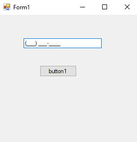

# 69-masked-text-box Snippets Code

## makedText example

### Program.cs

```c#
using System;
using System.Collections.Generic;
using System.ComponentModel;
using System.Data;
using System.Drawing;
using System.Linq;
using System.Text;
using System.Threading.Tasks;
using System.Windows.Forms;

namespace makedText
{
    public partial class Form1 : Form
    {
        public Form1()
        {
            InitializeComponent();
        }

        private void button1_Click(object sender, EventArgs e)
        {

        }
    }
}


//The MaskedTextBox allow the user to enter only one spcific type of data.
//for Ex number only or basic for the phone number or zip code and more.
//It is useful in many ways.
//we can also create our own maskedTextBox type if you want just search on google maskedTextBox Custom .....


```

### Ouput




