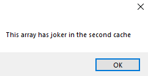
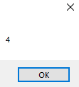

# 7-array Snippets Code

## 1- Example

### Program.cs

```c#
using System;
using System.Collections.Generic;
using System.ComponentModel;
using System.Data;
using System.Drawing;
using System.Linq;
using System.Text;
using System.Threading.Tasks;
using System.Windows.Forms;

namespace arraySystem
{
    public partial class Form1 : Form
    {
        public Form1()
        {
            InitializeComponent();
        }

        private void button1_Click(object sender, EventArgs e)
        {


            string[] arr = { "guna", "joker", "hacker", "doer", "maker" };

            if (arr[1] == "joker") {

                MessageBox.Show("This array has joker in the second cache");
            }

        }
    }
}


```

### Ouput




## 2- Example

### Program.cs

```c#
using System;
using System.Collections.Generic;
using System.ComponentModel;
using System.Data;
using System.Drawing;
using System.Linq;
using System.Text;
using System.Threading.Tasks;
using System.Windows.Forms;

namespace arraySystem
{
    public partial class Form1 : Form
    {
        public Form1()
        {
            InitializeComponent();
        }

        private void button1_Click(object sender, EventArgs e)
        {


            string[] arrName = new string[5];
            arrName[0] = "guna";
            arrName[1] = "joker";
            arrName[2] = "maker";
            arrName[3] = "doer";
            arrName[4] = "rakulan";

            MessageBox.Show(arrName[2]);

        }
    }
}
```

### Ouput


## 3- Example

### Program.cs

```c#
using System;
using System.Collections.Generic;
using System.ComponentModel;
using System.Data;
using System.Drawing;
using System.Linq;
using System.Text;
using System.Threading.Tasks;
using System.Windows.Forms;

namespace arraySystem
{
    public partial class Form1 : Form
    {
        public Form1()
        {
            InitializeComponent();
        }

        private void button1_Click(object sender, EventArgs e)
        {


            int[] nums = new int[5];
            nums[0] = 1;
            nums[1] = 2;
            nums[2] = 3;
            nums[3] = 4;
            nums[4] = 5;

            MessageBox.Show(nums[3].ToString());

        }
    }
}

```
### Ouput



      


