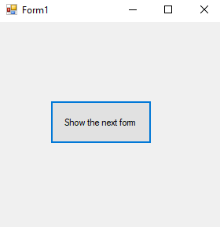
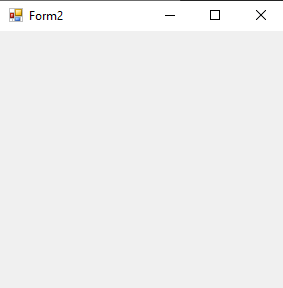
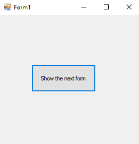
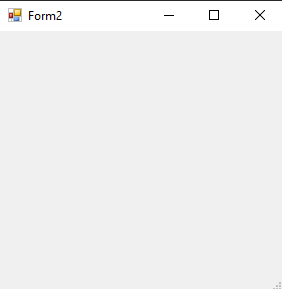
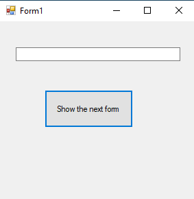
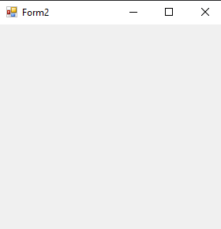

# 70-form Snippets Code

## 1-show example

### Program.cs

```c#
using System;
using System.Collections.Generic;
using System.ComponentModel;
using System.Data;
using System.Drawing;
using System.Linq;
using System.Text;
using System.Threading.Tasks;
using System.Windows.Forms;

namespace formsstem
{
    public partial class Form1 : Form
    {
        public Form1()
        {
            InitializeComponent();
        }

        private void button1_Click(object sender, EventArgs e)
        {

            Form2 f = new Form2();
            //we have created an instance of the form2.
            //Then we show the form.
            f.Show();
            
        }
    }
}


```

### Ouput




## 2-show-dialog example

### Program.cs

```c#
using System;
using System.Collections.Generic;
using System.ComponentModel;
using System.Data;
using System.Drawing;
using System.Linq;
using System.Text;
using System.Threading.Tasks;
using System.Windows.Forms;

namespace formsstem
{
    public partial class Form1 : Form
    {
        public Form1()
        {
            InitializeComponent();
        }

        private void button1_Click(object sender, EventArgs e)
        {

            Form2 f = new Form2();
            f.ShowDialog();

            //The Show() and ShowDialog() look similar but the ShowDialog() is diffrent.
            //ShowDialog() will be first like has heighr Z-index property.
            //In others words ShowDialog() will give more priority than the Show();
            
        }
    }
}


```

### Ouput





## 3-constructor example

### Program.cs

```c#
using System;
using System.Collections.Generic;
using System.ComponentModel;
using System.Data;
using System.Drawing;
using System.Linq;
using System.Text;
using System.Threading.Tasks;
using System.Windows.Forms;

namespace formsstem
{
    public partial class Form1 : Form
    {
        public Form1()
        {
            InitializeComponent();
        }

        private void button1_Click(object sender, EventArgs e)
        {

            Form2 f = new Form2(textBox1.Text);
            f.Show();
            
        }
    }
}

//We have passed parameter to the form2();

```

### Ouput



