# 71-mdi-Snippets Code

## 1- example

### Program.cs

```c#
using System;
using System.Collections.Generic;
using System.ComponentModel;
using System.Data;
using System.Drawing;
using System.Linq;
using System.Text;
using System.Threading.Tasks;
using System.Windows.Forms;

namespace mdi
{
    public partial class Form1 : Form
    {
        public Form1()
        {
            InitializeComponent();
        }

        private void button1_Click(object sender, EventArgs e)
        {

            Form2 f2 = new Form2();//we create an instance of the form2 
            f2.MdiParent = this;//then we assign the form2 to this mdiPresnt.
            f2.Show();

            Form3 f3 = new Form3();
            f3.MdiParent = this;
            f3.Show();

            Form4 f4 = new Form4();
            f4.MdiParent = this;
            f4.Show();

        }
    }
}


//Multi Document Interface means form inside forms.

```

### Ouput

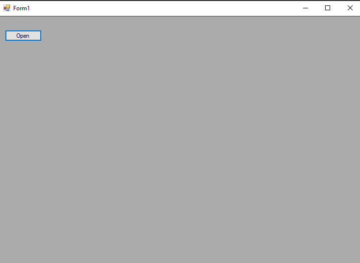
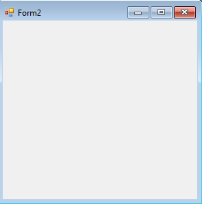
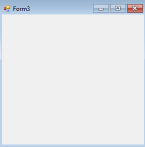
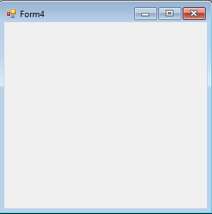

## 2-arrangeIcons example

### Program.cs

```c#
using System;
using System.Collections.Generic;
using System.ComponentModel;
using System.Data;
using System.Drawing;
using System.Linq;
using System.Text;
using System.Threading.Tasks;
using System.Windows.Forms;

namespace mdi
{
    public partial class Form1 : Form
    {
        public Form1()
        {
            InitializeComponent();
        }

        private void button1_Click(object sender, EventArgs e)
        {

            Form2 f2 = new Form2();//we create an instance of the form2 
            f2.MdiParent = this;//then we assign the form2 to this mdiPresnt.
            f2.Show();

            Form3 f3 = new Form3();
            f3.MdiParent = this;
            f3.Show();

            Form4 f4 = new Form4();
            f4.MdiParent = this;
            f4.Show();

        }

        private void button2_Click(object sender, EventArgs e)
        {
            this.LayoutMdi(MdiLayout.ArrangeIcons);
        }
    }
}


//ArrangeIcons will arrange the forms when the forms are minimized


```

### Ouput

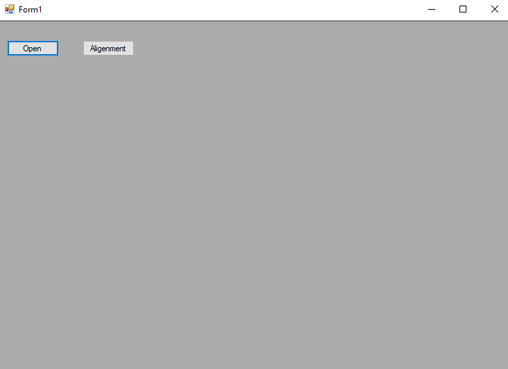
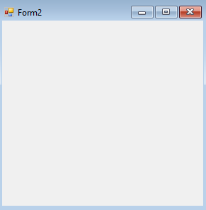
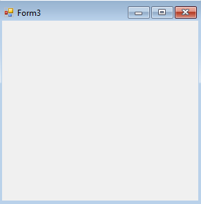
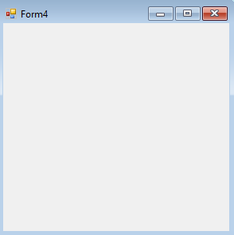

## 3-cascade example

### Program.cs

```c#
using System;
using System.Collections.Generic;
using System.ComponentModel;
using System.Data;
using System.Drawing;
using System.Linq;
using System.Text;
using System.Threading.Tasks;
using System.Windows.Forms;

namespace mdi
{
    public partial class Form1 : Form
    {
        public Form1()
        {
            InitializeComponent();
        }

        private void button1_Click(object sender, EventArgs e)
        {

            Form2 f2 = new Form2();//we create an instance of the form2 
            f2.MdiParent = this;//then we assign the form2 to this mdiPresnt.
            f2.Show();

            Form3 f3 = new Form3();
            f3.MdiParent = this;
            f3.Show();

            Form4 f4 = new Form4();
            f4.MdiParent = this;
            f4.Show();

        }

        private void button2_Click(object sender, EventArgs e)
        {
            this.LayoutMdi(MdiLayout.Cascade);
        }
    }
}


//Cascade will make the forms a litte bit big and arranged properly.

```

### Ouput

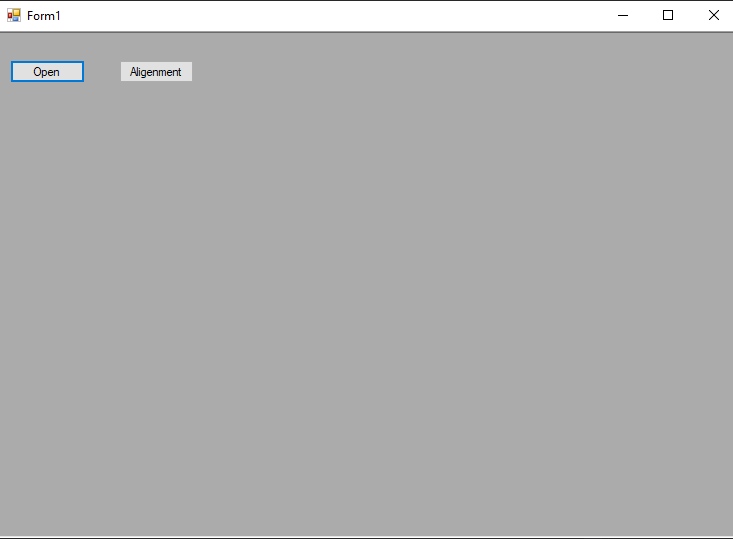

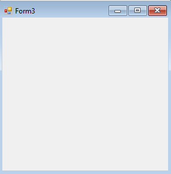


## 4-tile-horizontal example
### Program.cs

```c#
using System;
using System.Collections.Generic;
using System.ComponentModel;
using System.Data;
using System.Drawing;
using System.Linq;
using System.Text;
using System.Threading.Tasks;
using System.Windows.Forms;

namespace mdi
{
    public partial class Form1 : Form
    {
        public Form1()
        {
            InitializeComponent();
        }

        private void button1_Click(object sender, EventArgs e)
        {

            Form2 f2 = new Form2();//we create an instance of the form2 
            f2.MdiParent = this;//then we assign the form2 to this mdiPresnt.
            f2.Show();

            Form3 f3 = new Form3();
            f3.MdiParent = this;
            f3.Show();

            Form4 f4 = new Form4();
            f4.MdiParent = this;
            f4.Show();

        }

        private void button2_Click(object sender, EventArgs e)
        {
            this.LayoutMdi(MdiLayout.TileHorizontal);
        }
    }
}


//TileHorizontal will arrange the form Horizontally.

```

### Ouput

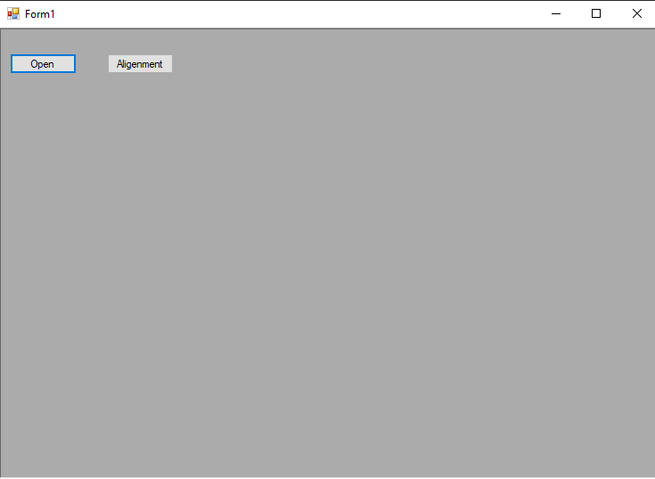
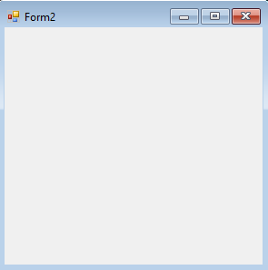


## 5-tile-vertical example
### Program.cs

```c#
using System;
using System.Collections.Generic;
using System.ComponentModel;
using System.Data;
using System.Drawing;
using System.Linq;
using System.Text;
using System.Threading.Tasks;
using System.Windows.Forms;

namespace mdi
{
    public partial class Form1 : Form
    {
        public Form1()
        {
            InitializeComponent();
        }

        private void button1_Click(object sender, EventArgs e)
        {

            Form2 f2 = new Form2();//we create an instance of the form2 
            f2.MdiParent = this;//then we assign the form2 to this mdiPresnt.
            f2.Show();

            Form3 f3 = new Form3();
            f3.MdiParent = this;
            f3.Show();

            Form4 f4 = new Form4();
            f4.MdiParent = this;
            f4.Show();

        }

        private void button2_Click(object sender, EventArgs e)
        {
            this.LayoutMdi(MdiLayout.TileVertical);
        }
    }
}


//TileVertical will arrange the forms Vertically.

```

### Ouput

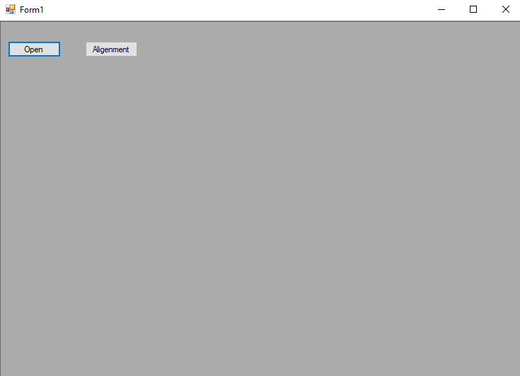
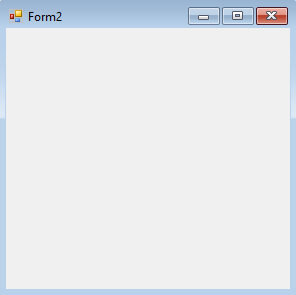
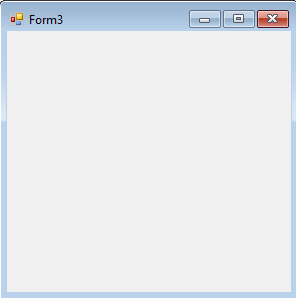
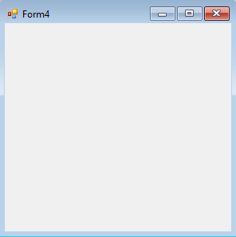