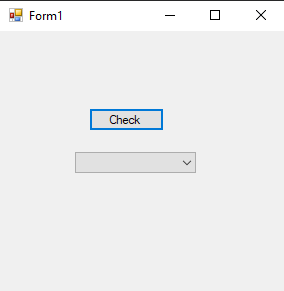
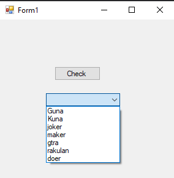
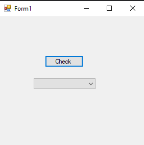
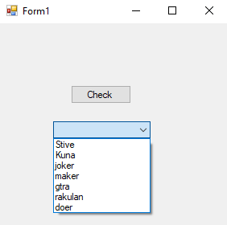
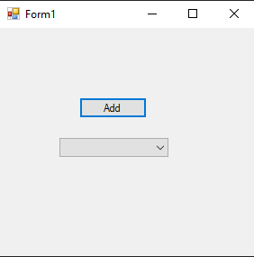
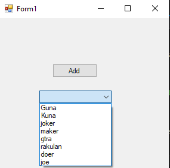
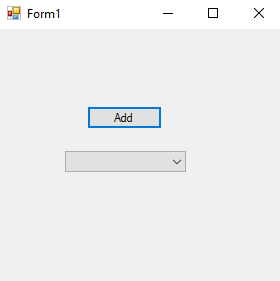
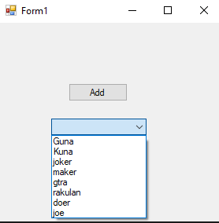
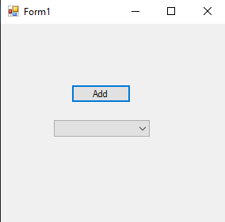
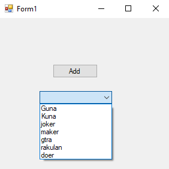

# 72-combo-box-Snippets Code

## 1- example

### Program.cs

```c#
using System;
using System.Collections.Generic;
using System.ComponentModel;
using System.Data;
using System.Drawing;
using System.Linq;
using System.Text;
using System.Threading.Tasks;
using System.Windows.Forms;

namespace combo
{
    public partial class Form1 : Form
    {
        public Form1()
        {
            InitializeComponent();
        }

        private void button1_Click(object sender, EventArgs e)
        {
            if (comboBox1.Text == "doer") {

                MessageBox.Show("Doer is exits");
            }
        }
    }
}


```

### Ouput





## 2-change-item example

### Program.cs

```c#

using System;
using System.Collections.Generic;
using System.ComponentModel;
using System.Data;
using System.Drawing;
using System.Linq;
using System.Text;
using System.Threading.Tasks;
using System.Windows.Forms;

namespace combo
{
    public partial class Form1 : Form
    {
        public Form1()
        {
            InitializeComponent();
        }

        private void button1_Click(object sender, EventArgs e)
        {

            comboBox1.Items[0] = "Stive";//I have changed the first item to  'Stive';
            //Item is array bashed.


        }

        private void comboBox1_SelectedIndexChanged(object sender, EventArgs e)
        {

        }

        private void Form1_Load(object sender, EventArgs e)
        {

        }
    }
}


```

### Ouput





## 3-add example

### Program.cs

```c#

 using System;
using System.Collections.Generic;
using System.ComponentModel;
using System.Data;
using System.Drawing;
using System.Linq;
using System.Text;
using System.Threading.Tasks;
using System.Windows.Forms;

namespace combo
{
    public partial class Form1 : Form
    {
        public Form1()
        {
            InitializeComponent();
        }

        private void button1_Click(object sender, EventArgs e)
        {


            comboBox1.Items.Add("joe");//adding items.

        }

        private void comboBox1_SelectedIndexChanged(object sender, EventArgs e)
        {

        }

        private void Form1_Load(object sender, EventArgs e)
        {

        }
    }
}


```

### Ouput





## 4-count example
### Program.cs

```c#
using System;
using System.Collections.Generic;
using System.ComponentModel;
using System.Data;
using System.Drawing;
using System.Linq;
using System.Text;
using System.Threading.Tasks;
using System.Windows.Forms;

namespace combo
{
    public partial class Form1 : Form
    {
        public Form1()
        {
            InitializeComponent();
        }

        private void button1_Click(object sender, EventArgs e)
        {


            MessageBox.Show(comboBox1.Items.Count.ToString());//Returns the how many items in the comboBox.

        }

        private void comboBox1_SelectedIndexChanged(object sender, EventArgs e)
        {

        }

        private void Form1_Load(object sender, EventArgs e)
        {

        }
    }
}


```

### Ouput




## 5-selected-index-changed example
### Program.cs

```c#
using System;
using System.Collections.Generic;
using System.ComponentModel;
using System.Data;
using System.Drawing;
using System.Linq;
using System.Text;
using System.Threading.Tasks;
using System.Windows.Forms;

namespace combo
{
    public partial class Form1 : Form
    {
        public Form1()
        {
            InitializeComponent();
        }

        private void button1_Click(object sender, EventArgs e)
        {


           
        }

        private void comboBox1_SelectedIndexChanged(object sender, EventArgs e)//This will run when the user select diffrent items.
        {

            MessageBox.Show("Test");
        }

        private void Form1_Load(object sender, EventArgs e)
        {

        }
    }
}


```

### Ouput



