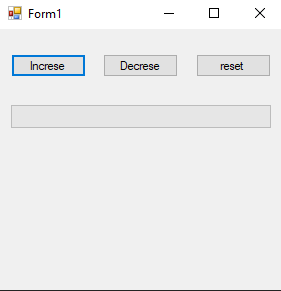
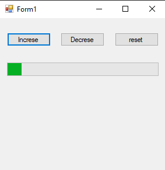
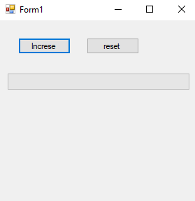
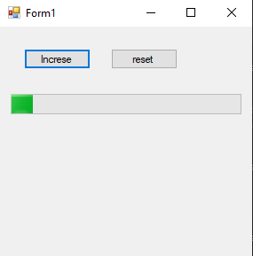
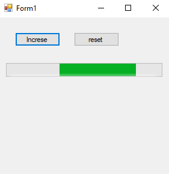

# 73-prograss-bar Snippets Code

## 1-example

### Program.cs

```c#

using System;
using System.Collections.Generic;
using System.ComponentModel;
using System.Data;
using System.Drawing;
using System.Linq;
using System.Text;
using System.Threading.Tasks;
using System.Windows.Forms;

namespace pro2
{
    public partial class Form1 : Form
    {
        public Form1()
        {
            InitializeComponent();
        }

        private void button1_Click(object sender, EventArgs e)
        {
            progressBar1.Value += 10;
        }

        private void button2_Click(object sender, EventArgs e)
        {
            progressBar1.Value -=10;
        }

        private void button3_Click(object sender, EventArgs e)
        {
            progressBar1.Value = 0;
        }
    }
}


```

### Ouput




## 2-perform-step example

### Program.cs

```c#

using System;
using System.Collections.Generic;
using System.ComponentModel;
using System.Data;
using System.Drawing;
using System.Linq;
using System.Text;
using System.Threading.Tasks;
using System.Windows.Forms;

namespace pro2
{
    public partial class Form1 : Form
    {
        public Form1()
        {
            InitializeComponent();
        }

        private void button1_Click(object sender, EventArgs e)
        {
            progressBar1.PerformStep();
            //This method is better the old one.
            //This method increses the value that has set in the step property.
        }

        private void button2_Click(object sender, EventArgs e)
        {
            
        }

        private void button3_Click(object sender, EventArgs e)
        {
            progressBar1.Value = 0;
        }
    }
}
//The old method increse the value by 10 every time that the user click the button.
//if the value goes over 100 the program will genarate an error.
//In order to prevent that error we must use PerformStep();

```

### Ouput





## 3-marquee-animation-speed example

### Program.cs

```c#

   using System;
using System.Collections.Generic;
using System.ComponentModel;
using System.Data;
using System.Drawing;
using System.Linq;
using System.Text;
using System.Threading.Tasks;
using System.Windows.Forms;

namespace pro2
{
    public partial class Form1 : Form
    {
        public Form1()
        {
            InitializeComponent();
        }

        private void button1_Click(object sender, EventArgs e)
        {

            progressBar1.MarqueeAnimationSpeed = 5;

        }

        private void button2_Click(object sender, EventArgs e)
        {
            
        }

        private void button3_Click(object sender, EventArgs e)
        {
            progressBar1.Style = ProgressBarStyle.Blocks;
        }
    }
}


```

### Ouput



