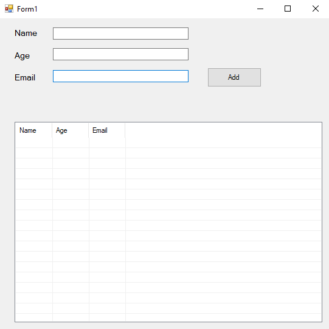
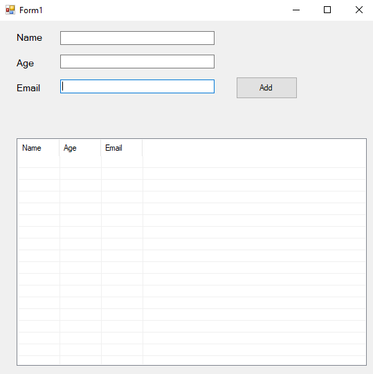
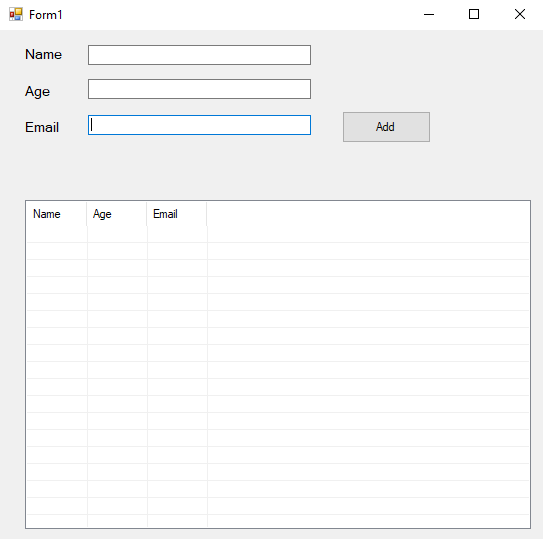
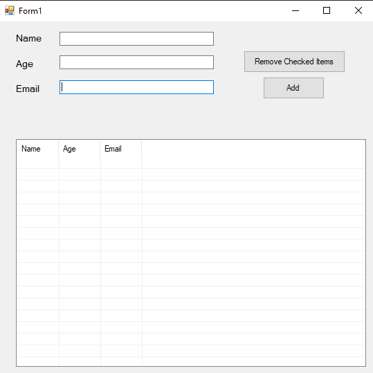

# 74-list-view Snippets Code

## 1-example

### Program.cs

```c#

using System;
using System.Collections.Generic;
using System.ComponentModel;
using System.Data;
using System.Drawing;
using System.Linq;
using System.Text;
using System.Threading.Tasks;
using System.Windows.Forms;

namespace listViewSystem
{
    public partial class Form1 : Form
    {
        public Form1()
        {
            InitializeComponent();
        }

        private void Form1_Load(object sender, EventArgs e)
        {

        }

        private void button1_Click(object sender, EventArgs e)
        {

            ListViewItem lv1 = new ListViewItem(textBox1.Text);//we must give the first item in the constructor.
            lv1.SubItems.Add(textBox2.Text);
            lv1.SubItems.Add(textBox3.Text);

            listView1.Items.Add(lv1);

            textBox1.Text = "";
            textBox2.Text = "";
            textBox3.Text = "";


        }
    }
}


```

### Ouput




## 2-context-menu-strip example

### Program.cs

```c#
using System;
using System.Collections.Generic;
using System.ComponentModel;
using System.Data;
using System.Drawing;
using System.Linq;
using System.Text;
using System.Threading.Tasks;
using System.Windows.Forms;

namespace listViewSystem
{
    public partial class Form1 : Form
    {
        public Form1()
        {
            InitializeComponent();
        }

        private void Form1_Load(object sender, EventArgs e)
        {

        }

        private void button1_Click(object sender, EventArgs e)
        {

            ListViewItem lv1 = new ListViewItem(textBox1.Text);//we must give the first item in the constructor.
            lv1.SubItems.Add(textBox2.Text);
            lv1.SubItems.Add(textBox3.Text);

            listView1.Items.Add(lv1);

            textBox1.Text = "";
            textBox2.Text = "";
            textBox3.Text = "";


        }

        private void contextMenuStrip1_Opening(object sender, CancelEventArgs e)
        {

        }

        private void getTheItemToolStripMenuItem_Click(object sender, EventArgs e)
        {
            if (listView1.SelectedItems.Count != 0) {//if the listView has data in it.

                MessageBox.Show(listView1.SelectedItems[0].SubItems[0].Text);
                //we select the first selectedItems then we select first SubItems.

            
            }
        }
    }
}

```

### Ouput




## 3-multi-selected example

### Program.cs

```c#
using System;
using System.Collections.Generic;
using System.ComponentModel;
using System.Data;
using System.Drawing;
using System.Linq;
using System.Text;
using System.Threading.Tasks;
using System.Windows.Forms;

namespace listViewSystem
{
    public partial class Form1 : Form
    {
        public Form1()
        {
            InitializeComponent();
        }

        private void Form1_Load(object sender, EventArgs e)
        {

        }

        private void button1_Click(object sender, EventArgs e)
        {

            ListViewItem lv1 = new ListViewItem(textBox1.Text);//we must give the first item in the constructor.
            lv1.SubItems.Add(textBox2.Text);
            lv1.SubItems.Add(textBox3.Text);

            listView1.Items.Add(lv1);

            textBox1.Text = "";
            textBox2.Text = "";
            textBox3.Text = "";


        }

        private void contextMenuStrip1_Opening(object sender, CancelEventArgs e)
        {

        }

        private void getTheItemToolStripMenuItem_Click(object sender, EventArgs e)
        {

            foreach (ListViewItem lvi in listView1.SelectedItems) {
                //we loop torugh the items.

                MessageBox.Show(lvi.SubItems[0].Text);

            }

        }
    }
}


```

### Ouput


## 4-remove-and-clear-items example

### Program.cs

```c#
using System;
using System.Collections.Generic;
using System.ComponentModel;
using System.Data;
using System.Drawing;
using System.Linq;
using System.Text;
using System.Threading.Tasks;
using System.Windows.Forms;

namespace listViewSystem
{
    public partial class Form1 : Form
    {
        public Form1()
        {
            InitializeComponent();
        }

        private void Form1_Load(object sender, EventArgs e)
        {

        }

        private void button1_Click(object sender, EventArgs e)
        {

            ListViewItem lv1 = new ListViewItem(textBox1.Text);//we must give the first item in the constructor.
            lv1.SubItems.Add(textBox2.Text);
            lv1.SubItems.Add(textBox3.Text);

            listView1.Items.Add(lv1);

            textBox1.Text = "";
            textBox2.Text = "";
            textBox3.Text = "";


        }

        private void contextMenuStrip1_Opening(object sender, CancelEventArgs e)
        {

        }

        private void getTheItemToolStripMenuItem_Click(object sender, EventArgs e)
        {

            foreach (ListViewItem lvi in listView1.SelectedItems) {
                //we loop torugh the items.

                MessageBox.Show(lvi.SubItems[0].Text);

            }

        }

        private void removeItemsToolStripMenuItem_Click(object sender, EventArgs e)
        {

            foreach (ListViewItem lvi in listView1.SelectedItems)
            {
               
                //This will remove the selected items.
                lvi.Remove();

            }
        }

        private void removeAllItemsToolStripMenuItem_Click(object sender, EventArgs e)
        {
            listView1.Items.Clear();
           
        }
    }
}

```

### Ouput




## 5-remove-checked-items example

### Program.cs

```c#
using System;
using System.Collections.Generic;
using System.ComponentModel;
using System.Data;
using System.Drawing;
using System.Linq;
using System.Text;
using System.Threading.Tasks;
using System.Windows.Forms;

namespace listViewSystem
{
    public partial class Form1 : Form
    {
        public Form1()
        {
            InitializeComponent();
        }

        private void Form1_Load(object sender, EventArgs e)
        {

        }

        private void button1_Click(object sender, EventArgs e)
        {

            ListViewItem lv1 = new ListViewItem(textBox1.Text);//we must give the first item in the constructor.
            lv1.SubItems.Add(textBox2.Text);
            lv1.SubItems.Add(textBox3.Text);

            listView1.Items.Add(lv1);

            textBox1.Text = "";
            textBox2.Text = "";
            textBox3.Text = "";


        }

        private void contextMenuStrip1_Opening(object sender, CancelEventArgs e)
        {

        }

        private void getTheItemToolStripMenuItem_Click(object sender, EventArgs e)
        {

            foreach (ListViewItem lvi in listView1.SelectedItems) {
                //we loop torugh the items.

                MessageBox.Show(lvi.SubItems[0].Text);

            }

        }

        private void removeItemsToolStripMenuItem_Click(object sender, EventArgs e)
        {

            foreach (ListViewItem lvi in listView1.SelectedItems)
            {
               
                //This will remove the selected items.
                lvi.Remove();

            }
        }

        private void removeAllItemsToolStripMenuItem_Click(object sender, EventArgs e)
        {
            listView1.Items.Clear();
           
        }

        private void button2_Click(object sender, EventArgs e)
        {
            foreach (ListViewItem item in listView1.Items)//we cannot use SelectedItems we must use Items.
            {

                if (item.Checked) {

                    item.Remove();
                }

            }
        }
    }
}


```

### Ouput

