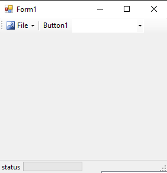
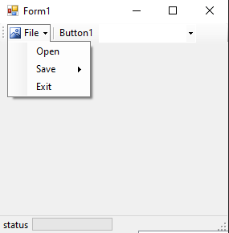
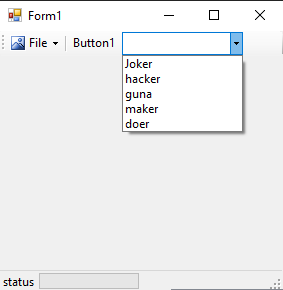

# 76-status-strip Snippets Code

## tool example

### Program.cs

```c#
using System;
using System.Collections.Generic;
using System.ComponentModel;
using System.Data;
using System.Drawing;
using System.Linq;
using System.Text;
using System.Threading.Tasks;
using System.Windows.Forms;

namespace tool
{
    public partial class Form1 : Form
    {
        public Form1()
        {
            InitializeComponent();
        }
    }
}


```

### Ouput






