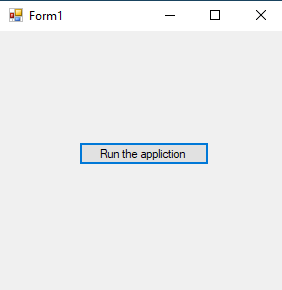
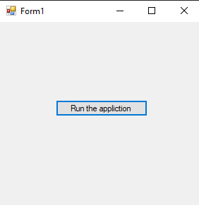

# 77-notifyIcon-control Snippets Code

## 1- example

### Program.cs

```c#
using System;
using System.Collections.Generic;
using System.ComponentModel;
using System.Data;
using System.Drawing;
using System.Linq;
using System.Text;
using System.Threading.Tasks;
using System.Windows.Forms;

namespace notifyIcon
{
    public partial class Form1 : Form
    {
        public Form1()
        {
            InitializeComponent();
        }

        private void button1_Click(object sender, EventArgs e)
        {
           
            notifyIcon1.ShowBalloonTip(1000, "The Title", "My Test", ToolTipIcon.Info);
            
            //first parameter is the time for visible
            //Second parameter is the title
            //Third is the MSG
            //fourth is the type of visible method. like information or Warning or error and more

        }


        private void notifyIcon1_MouseDoubleClick(object sender, MouseEventArgs e)
        {
         
        }

        private void Form1_Load(object sender, EventArgs e)
        {

        }

    }
}


```

### Ouput



## 2-advanced example

### Program.cs

```c#

using System;
using System.Collections.Generic;
using System.ComponentModel;
using System.Data;
using System.Drawing;
using System.Linq;
using System.Text;
using System.Threading.Tasks;
using System.Windows.Forms;

namespace notifyIcon
{
    public partial class Form1 : Form
    {
        public Form1()
        {
            InitializeComponent();
        }

        private void button1_Click(object sender, EventArgs e)
        {
            this.Hide();//This is used to hide the application from the taskbar.
            notifyIcon1.ShowBalloonTip(1000, "Appliction is running in background", "My Test", ToolTipIcon.Info);
            
            //first parameter is the time for visible
            //Second parameter is the title
            //Third is the MSG
            //fourth is the type of visible method. like information or Warning or error and more

        }


        private void notifyIcon1_MouseDoubleClick(object sender, MouseEventArgs e)
        {
            this.Show();
        }

        private void Form1_Load(object sender, EventArgs e)
        {

        }

    }
}


//This is mainly used for hiding the application
//If we use this method the appliction will be not be seen in the taskbar.
```

### Ouput




