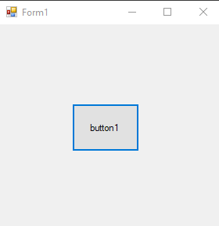
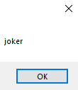
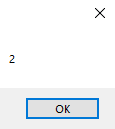

# 8-list Snippets Code

## 1- Example

### Program.cs

```c#
using System;
using System.Collections.Generic;
using System.ComponentModel;
using System.Data;
using System.Drawing;
using System.Linq;
using System.Text;
using System.Threading.Tasks;
using System.Windows.Forms;

namespace list
{
    public partial class Form1 : Form
    {
        public Form1()
        {
            InitializeComponent();
        }

        private void button1_Click(object sender, EventArgs e)
        {

            List<string> names = new List<string>();
            names.Add("guna");
            names.Add("joker");
            names.Add("hacker");
            names.Add("maker");

            MessageBox.Show(names[1]);
            names.RemoveAt(1);//this is will remove the joker.

          
        }
    }
}


```

### Ouput




## 2- Example

### Program.cs

```c#
using System;
using System.Collections.Generic;
using System.ComponentModel;
using System.Data;
using System.Drawing;
using System.Linq;
using System.Text;
using System.Threading.Tasks;
using System.Windows.Forms;

namespace list
{
    public partial class Form1 : Form
    {
        public Form1()
        {
            InitializeComponent();
        }

        private void button1_Click(object sender, EventArgs e)
        {

           
        
            List<int> nums=new List<int>();
            nums.Add(1);
            nums.Add(2);

            MessageBox.Show(nums[1].ToString());

            
        }
    }
}

```

### Ouput





