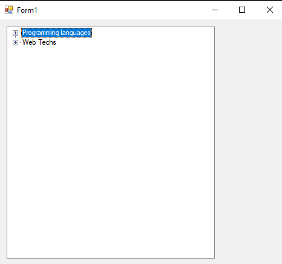
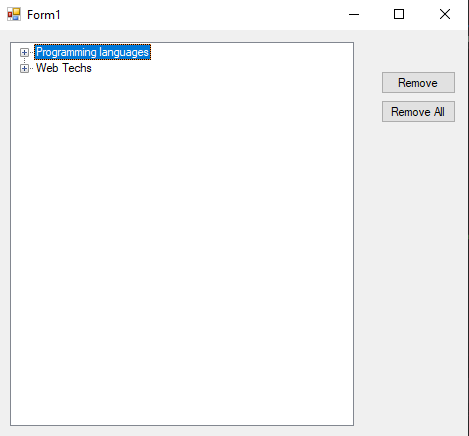
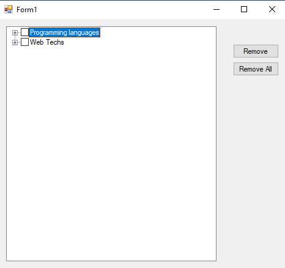
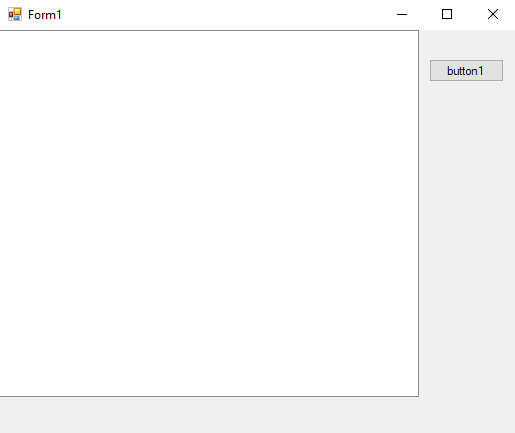
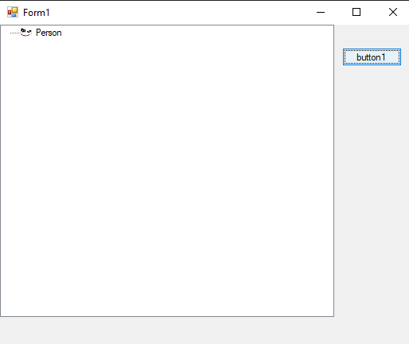

# 80-tree-view Snippets Code

## 1- example

### Program.cs

```c#
using System;
using System.Collections.Generic;
using System.ComponentModel;
using System.Data;
using System.Drawing;
using System.Linq;
using System.Text;
using System.Threading.Tasks;
using System.Windows.Forms;

namespace treeViewCon
{
    public partial class Form1 : Form
    {
        public Form1()
        {
            InitializeComponent();
        }

        private void Form1_Load(object sender, EventArgs e)
        {

            treeView1.Nodes.Add("Programming languages");//main header
            treeView1.Nodes[0].Nodes.Add("Java");//1 dimmentional
            treeView1.Nodes[0].Nodes.Add("C++");
            treeView1.Nodes[0].Nodes.Add("Python");
            treeView1.Nodes[0].Nodes.Add("Frameworks");
            treeView1.Nodes[0].Nodes[3].Nodes.Add("Jquery");//2 dimmentional
            treeView1.Nodes[0].Nodes[3].Nodes.Add("Jquery UI");
            treeView1.Nodes[0].Nodes[3].Nodes.Add("Prototype");
            treeView1.Nodes[0].Nodes[3].Nodes[2].Nodes.Add("Ver1");//3 dimmentional
            treeView1.Nodes[0].Nodes[3].Nodes[2].Nodes.Add("Ver2");

            treeView1.Nodes.Add("Web Techs");
            treeView1.Nodes[1].Nodes.Add("Html");
            treeView1.Nodes[1].Nodes.Add("Css");
            treeView1.Nodes[1].Nodes[1].Nodes.Add("Less");
            treeView1.Nodes[1].Nodes[1].Nodes.Add("Sass");
            treeView1.Nodes[1].Nodes[1].Nodes[1].Nodes.Add("Ver1");
            treeView1.Nodes[1].Nodes[1].Nodes[1].Nodes.Add("Ver2");

        }
    }
}


```

### Ouput



## 2-remove-and-clear example

### Program.cs

```c#
using System;
using System.Collections.Generic;
using System.ComponentModel;
using System.Data;
using System.Drawing;
using System.Linq;
using System.Text;
using System.Threading.Tasks;
using System.Windows.Forms;

namespace treeViewCon
{
    public partial class Form1 : Form
    {
        public Form1()
        {
            InitializeComponent();
        }

        private void Form1_Load(object sender, EventArgs e)
        {

            treeView1.Nodes.Add("Programming languages");//main header
            treeView1.Nodes[0].Nodes.Add("Java");//1 dimmentional
            treeView1.Nodes[0].Nodes.Add("C++");
            treeView1.Nodes[0].Nodes.Add("Python");
            treeView1.Nodes[0].Nodes.Add("Frameworks");
            treeView1.Nodes[0].Nodes[3].Nodes.Add("Jquery");//2 dimmentional
            treeView1.Nodes[0].Nodes[3].Nodes.Add("Jquery UI");
            treeView1.Nodes[0].Nodes[3].Nodes.Add("Prototype");
            treeView1.Nodes[0].Nodes[3].Nodes[2].Nodes.Add("Ver1");//3 dimmentional
            treeView1.Nodes[0].Nodes[3].Nodes[2].Nodes.Add("Ver2");

            treeView1.Nodes.Add("Web Techs");
            treeView1.Nodes[1].Nodes.Add("Html");
            treeView1.Nodes[1].Nodes.Add("Css");
            treeView1.Nodes[1].Nodes[1].Nodes.Add("Less");
            treeView1.Nodes[1].Nodes[1].Nodes.Add("Sass");
            treeView1.Nodes[1].Nodes[1].Nodes[1].Nodes.Add("Ver1");
            treeView1.Nodes[1].Nodes[1].Nodes[1].Nodes.Add("Ver2");

        }

        private void button1_Click(object sender, EventArgs e)
        {
            treeView1.SelectedNode.Remove();//remove the selected note
            
        }

        private void button2_Click(object sender, EventArgs e)
        {
            treeView1.Nodes.Clear();//Clear all
        }
    }
}


```

### Ouput




## 3-tree-node-advanced example

### Program.cs

```c#
using System;
using System.Collections.Generic;
using System.ComponentModel;
using System.Data;
using System.Drawing;
using System.Linq;
using System.Text;
using System.Threading.Tasks;
using System.Windows.Forms;

namespace treeViewCon
{
    public partial class Form1 : Form
    {
        public Form1()
        {
            InitializeComponent();
        }

        private void Form1_Load(object sender, EventArgs e)
        {

            treeView1.Nodes.Add("Programming languages");//main header
            treeView1.Nodes[0].Nodes.Add("Java");//1 dimmentional
            treeView1.Nodes[0].Nodes.Add("C++");
            treeView1.Nodes[0].Nodes.Add("Python");
            treeView1.Nodes[0].Nodes.Add("Frameworks");
            treeView1.Nodes[0].Nodes[3].Nodes.Add("Jquery");//2 dimmentional
            treeView1.Nodes[0].Nodes[3].Nodes.Add("Jquery UI");
            treeView1.Nodes[0].Nodes[3].Nodes.Add("Prototype");
            treeView1.Nodes[0].Nodes[3].Nodes[2].Nodes.Add("Ver1");//3 dimmentional
            treeView1.Nodes[0].Nodes[3].Nodes[2].Nodes.Add("Ver2");

            treeView1.Nodes.Add("Web Techs");
            treeView1.Nodes[1].Nodes.Add("Html");
            treeView1.Nodes[1].Nodes.Add("Css");
            treeView1.Nodes[1].Nodes[1].Nodes.Add("Less");
            treeView1.Nodes[1].Nodes[1].Nodes.Add("Sass");
            treeView1.Nodes[1].Nodes[1].Nodes[1].Nodes.Add("Ver1");
            treeView1.Nodes[1].Nodes[1].Nodes[1].Nodes.Add("Ver2");

        }

        private void button1_Click(object sender, EventArgs e)
        {
            treeView1.SelectedNode.Remove();//remove the selected note
            
        }

        private void button2_Click(object sender, EventArgs e)
        {
            RemoveChecked(treeView1.Nodes);
            
        }

        List<TreeNode> tmpList = new List<TreeNode>();
        
        void RemoveChecked(TreeNodeCollection tnc) {


            foreach (TreeNode tn in tnc)
            {

                if (tn.Checked)
                {

                    tmpList.Add(tn);

                }
                else if (tn.Nodes.Count != 0) {

                    RemoveChecked(tn.Nodes);
                }

            }

            foreach (TreeNode tn in tmpList)
            {

                treeView1.Nodes.Remove(tn);
            }

        }

    }
}


```

### Ouput




## 4-image-list example

### Program.cs

```c#
using System;
using System.Collections.Generic;
using System.ComponentModel;
using System.Data;
using System.Drawing;
using System.Linq;
using System.Text;
using System.Threading.Tasks;
using System.Windows.Forms;

namespace listImages
{
    public partial class Form1 : Form
    {
        public Form1()
        {
            InitializeComponent();
        }

        private void button1_Click(object sender, EventArgs e)
        {
            TreeNode tn = new TreeNode();
            tn.Text = "Person";
            tn.ImageIndex = 1;
            tn.SelectedImageIndex = 0;
            treeView1.Nodes.Add(tn);

        }
    }
}


```

### Ouput


