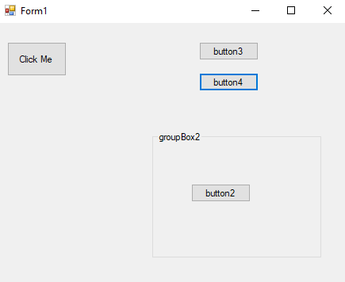
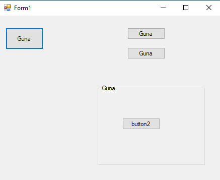
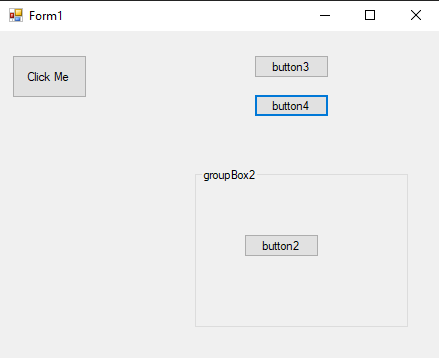
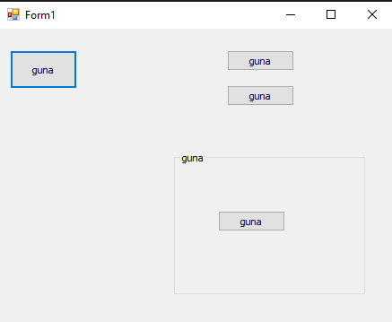
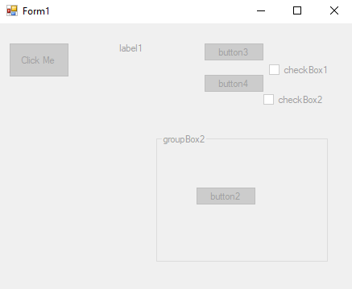
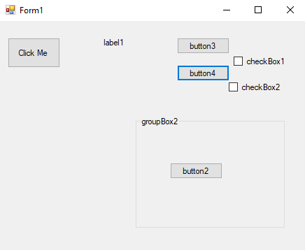
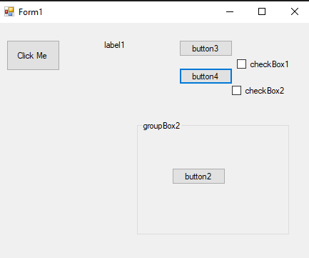
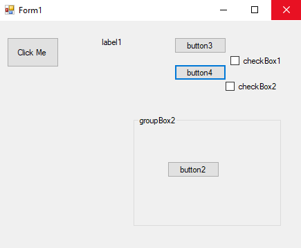
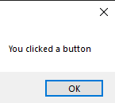

# 82-access-control Snippets Code

## 1- example

### Program.cs

```c#
using System;
using System.Collections.Generic;
using System.ComponentModel;
using System.Data;
using System.Drawing;
using System.Linq;
using System.Text;
using System.Threading.Tasks;
using System.Windows.Forms;

namespace AccessAllController
{
    public partial class Form1 : Form
    {
        public Form1()
        {
            InitializeComponent();
        }

        private void button1_Click(object sender, EventArgs e)
        {
            foreach (Control c in this.Controls) {

                c.Text = "Guna";
            }
        }
    }
}


```

### Ouput




## 2- example

### Program.cs

```c#
using System;
using System.Collections.Generic;
using System.ComponentModel;
using System.Data;
using System.Drawing;
using System.Linq;
using System.Text;
using System.Threading.Tasks;
using System.Windows.Forms;

namespace AccessAllController
{
    public partial class Form1 : Form
    {
        public Form1()
        {
            InitializeComponent();
        }

        private void button1_Click(object sender, EventArgs e)
        {

            AccessAll(this.Controls);
        }


        void AccessAll(Control.ControlCollection cc) {

            foreach (Control c in cc) {

                c.Text = "guna";

                if (c.HasChildren) {

                    AccessAll(c.Controls);
                }
            }
        }
    }
}


```

### Ouput




## 3-disabled-all-controllers example

### Program.cs

```c#
using System;
using System.Collections.Generic;
using System.ComponentModel;
using System.Data;
using System.Drawing;
using System.Linq;
using System.Text;
using System.Threading.Tasks;
using System.Windows.Forms;

namespace AccessAllController
{
    public partial class Form1 : Form
    {
        public Form1()
        {
            InitializeComponent();
        }

        private void button1_Click(object sender, EventArgs e)
        {

            AccessAll(this.Controls);
        }


        void AccessAll(Control.ControlCollection cc) {

            foreach (Control c in cc) {

                c.Enabled = false;//Disabled all controllers.

                if (c.HasChildren) {

                    AccessAll(c.Controls);
                }
            }
        }
    }
}


```

### Ouput




## 4-diabled-buttons example

### Program.cs

```c#
using System;
using System.Collections.Generic;
using System.ComponentModel;
using System.Data;
using System.Drawing;
using System.Linq;
using System.Text;
using System.Threading.Tasks;
using System.Windows.Forms;

namespace AccessAllController
{
    public partial class Form1 : Form
    {
        public Form1()
        {
            InitializeComponent();
        }

        private void button1_Click(object sender, EventArgs e)
        {

            AccessAll(this.Controls);
        }


        void AccessAll(Control.ControlCollection cc) {

            foreach (Control c in cc) {

                if (c is Button) {//Only buttons will be disabled.

                    c.Enabled = false;
                }

                if (c.HasChildren) {

                    AccessAll(c.Controls);
                }
            }
        }
    }
}


```

### Ouput




## 5-check-boxes example

### Program.cs

```c#
using System;
using System.Collections.Generic;
using System.ComponentModel;
using System.Data;
using System.Drawing;
using System.Linq;
using System.Text;
using System.Threading.Tasks;
using System.Windows.Forms;

namespace AccessAllController
{
    public partial class Form1 : Form
    {
        public Form1()
        {
            InitializeComponent();
        }

        private void button1_Click(object sender, EventArgs e)
        {

            AccessAll(this.Controls);
        }


        void AccessAll(Control.ControlCollection cc) {

            foreach (Control c in cc) {

                if (c is CheckBox) {//if c is check box.

                    CheckBox ch = c as CheckBox;//store all checkboxes in the ch variable.
                    ch.Checked = true;//than we checked all of them.

                }

                if (c.HasChildren) {

                    AccessAll(c.Controls);
                }
            }
        }
    }
}


```

### Ouput




## 6-button-event-handler example

### Program.cs

```c#
using System;
using System.Collections.Generic;
using System.ComponentModel;
using System.Data;
using System.Drawing;
using System.Linq;
using System.Text;
using System.Threading.Tasks;
using System.Windows.Forms;

namespace AccessAllController
{
    public partial class Form1 : Form
    {
        public Form1()
        {
            InitializeComponent();
        }

        private void button1_Click(object sender, EventArgs e)
        {

            AccessAll(this.Controls);
        }


        void AccessAll(Control.ControlCollection cc) {

            foreach (Control c in cc) {

                if (c is Button) {

                   Button b = c as Button;
                    b.Click += B_Click;

                }

                if (c.HasChildren) {

                    AccessAll(c.Controls);
                }
            }
        }

        private void B_Click(object sender, EventArgs e)
        {
            MessageBox.Show("You clicked a button");
        }
    }
}


```

### Ouput


