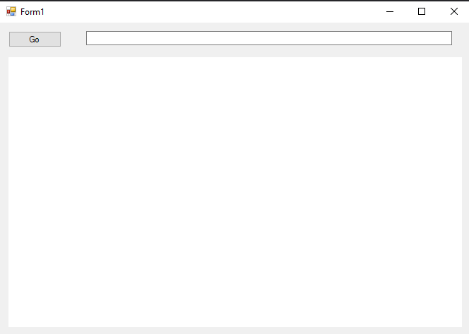
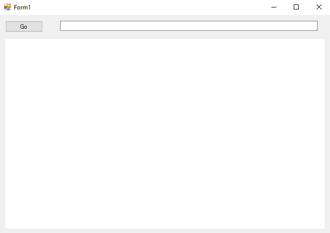
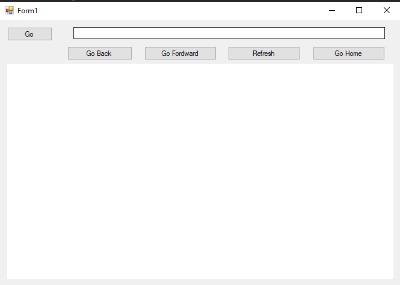
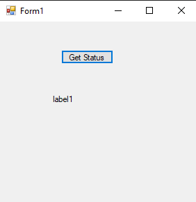
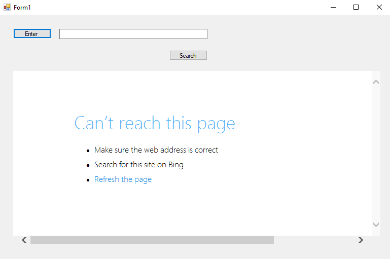

# 83-web-brower Snippets Code

## 1-basic-web-brower example

### Program.cs

```c#
using System;
using System.Collections.Generic;
using System.ComponentModel;
using System.Data;
using System.Drawing;
using System.Linq;
using System.Text;
using System.Threading.Tasks;
using System.Windows.Forms;

namespace webBrowesr
{
    public partial class Form1 : Form
    {
        public Form1()
        {
            InitializeComponent();
        }

        private void button1_Click(object sender, EventArgs e)
        {
            webBrowser1.Navigate(textBox1.Text);
        }
    }
}


```

### Ouput




## 2-navigated example

### Program.cs

```c#
using System;
using System.Collections.Generic;
using System.ComponentModel;
using System.Data;
using System.Drawing;
using System.Linq;
using System.Text;
using System.Threading.Tasks;
using System.Windows.Forms;

namespace webBrowesr
{
    public partial class Form1 : Form
    {
        public Form1()
        {
            InitializeComponent();
        }

        private void button1_Click(object sender, EventArgs e)
        {
            webBrowser1.Navigate(textBox1.Text);
        }

        private void webBrowser1_Navigated(object sender, WebBrowserNavigatedEventArgs e)
        {
            textBox1.Text = webBrowser1.Url.ToString();
        }
    }
}

```

### Ouput




## 3-advanced example

### Program.cs

```c#
using System;
using System.Collections.Generic;
using System.ComponentModel;
using System.Data;
using System.Drawing;
using System.Linq;
using System.Text;
using System.Threading.Tasks;
using System.Windows.Forms;

namespace webBrowesr
{
    public partial class Form1 : Form
    {
        public Form1()
        {
            InitializeComponent();
        }

        private void button1_Click(object sender, EventArgs e)
        {
            webBrowser1.Navigate(textBox1.Text);
        }

        private void webBrowser1_Navigated(object sender, WebBrowserNavigatedEventArgs e)
        {
            textBox1.Text = webBrowser1.Url.ToString();
        }

        private void button2_Click(object sender, EventArgs e)
        {
            webBrowser1.GoBack();

        }

        private void button3_Click(object sender, EventArgs e)
        {
            webBrowser1.GoForward();
        }

        private void button4_Click(object sender, EventArgs e)
        {
            webBrowser1.GoHome();
        }
    }
}


```

### Ouput




## 4-get-status example

### Program.cs

```c#
using System;
using System.Collections.Generic;
using System.ComponentModel;
using System.Data;
using System.Drawing;
using System.Linq;
using System.Text;
using System.Threading.Tasks;
using System.Windows.Forms;

namespace WebContentGet
{
    public partial class Form1 : Form
    {
        public Form1()
        {
            InitializeComponent();
        }

        WebBrowser wb = new WebBrowser();

        private void button1_Click(object sender, EventArgs e)
        {

            wb.Navigate("http://localhost/web/index.html");//URL
            wb.DocumentCompleted += Wb_DocumentCompleted;

        }

        private void Wb_DocumentCompleted(object sender, WebBrowserDocumentCompletedEventArgs e)
        {

            label1.Text = wb.Document.GetElementById("item").InnerText;
            //item is the id of the website

        }
    }
}


```

### Ouput




## 5-website-access example

### Program.cs

```c#

using System;
using System.Collections.Generic;
using System.ComponentModel;
using System.Data;
using System.Drawing;
using System.Linq;
using System.Text;
using System.Threading.Tasks;
using System.Windows.Forms;

namespace WebContentGet
{
    public partial class Form1 : Form
    {
        public Form1()
        {
            InitializeComponent();
        }

       

        private void button1_Click(object sender, EventArgs e)
        {

            webBrowser1.Document.GetElementById("se").InnerText = textBox1.Text;

        }

        private void button2_Click(object sender, EventArgs e)
        {

            webBrowser1.Document.GetElementById("search").InvokeMember("click");


        }
    }
}


```

### Ouput




