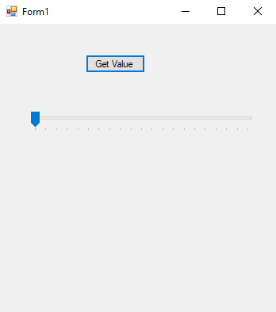
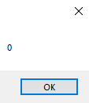

# 84-track-bar-control Snippets Code

## TrackBarControl example

### Program.cs

```c#

using System;
using System.Collections.Generic;
using System.ComponentModel;
using System.Data;
using System.Drawing;
using System.Linq;
using System.Text;
using System.Threading.Tasks;
using System.Windows.Forms;

namespace TrackBarControl
{
    public partial class Form1 : Form
    {
        public Form1()
        {
            InitializeComponent();
        }

        private void button1_Click(object sender, EventArgs e)
        {
            MessageBox.Show(trackBar1.Value.ToString());
        }
    }
}


```

### Ouput





