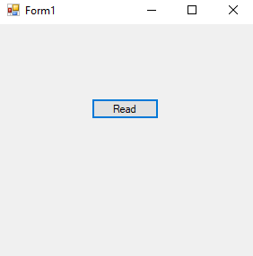
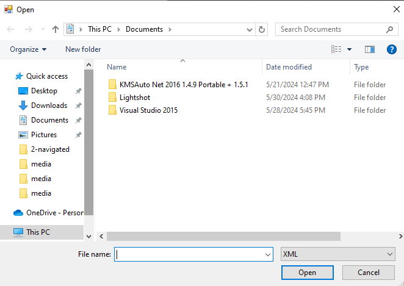
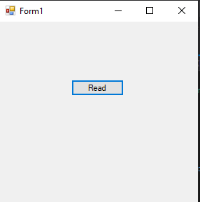
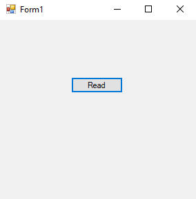
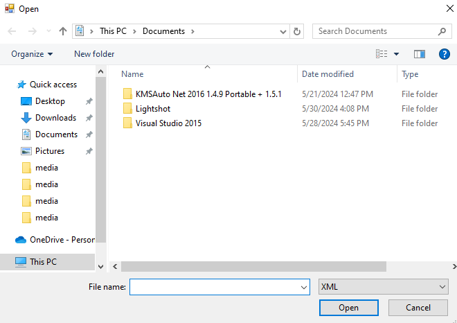

# 86-reading-xml Snippets Code

## 1-example

### Program.cs

```c#
using System;
using System.Collections.Generic;
using System.ComponentModel;
using System.Data;
using System.Drawing;
using System.Linq;
using System.Text;
using System.Threading.Tasks;
using System.Windows.Forms;
using System.Xml;//Must be 

namespace readingXML
{
    public partial class Form1 : Form
    {
        public Form1()
        {
            InitializeComponent();
        }

        private void button1_Click(object sender, EventArgs e)
        {

            OpenFileDialog ofd = new OpenFileDialog();

            ofd.Filter = "XML|*.xml";//allowed file types.

            if (ofd.ShowDialog() == DialogResult.OK) {

                XmlDocument xDoc = new XmlDocument();
                xDoc.Load(ofd.FileName);//We can put URL 
                string Namevalue= xDoc.SelectSingleNode("people/person/name").InnerText;
                string AgeVlaue = xDoc.SelectSingleNode("people/person/age").InnerText;
                MessageBox.Show(Namevalue);
                MessageBox.Show(AgeVlaue);
            }


        }
    }
}


```

### Ouput




## 2-online-xml-reading example

### Program.cs

```c#
using System;
using System.Collections.Generic;
using System.ComponentModel;
using System.Data;
using System.Drawing;
using System.Linq;
using System.Text;
using System.Threading.Tasks;
using System.Windows.Forms;
using System.Xml;//Must be 

namespace readingXML
{
    public partial class Form1 : Form
    {
        public Form1()
        {
            InitializeComponent();
        }

        private void button1_Click(object sender, EventArgs e)
        {


            XmlDocument xDoc = new XmlDocument();
            xDoc.Load("http://localhost/web/ExampleXML.xml");
            string value= xDoc.SelectSingleNode("people/person/name").InnerText;
            MessageBox.Show(value) ;


        }
    }
}


```

### Ouput



## 3-foreach-xml example

### Program.cs

```c#
using System;
using System.Collections.Generic;
using System.ComponentModel;
using System.Data;
using System.Drawing;
using System.Linq;
using System.Text;
using System.Threading.Tasks;
using System.Windows.Forms;
using System.Xml;//Must be 

namespace readingXML
{
    public partial class Form1 : Form
    {
        public Form1()
        {
            InitializeComponent();
        }

        private void button1_Click(object sender, EventArgs e)
        {


            OpenFileDialog ofd = new OpenFileDialog();
            ofd.Filter = "XML|*.xml";

            if (ofd.ShowDialog() == DialogResult.OK)
            {

                XmlDocument doc = new XmlDocument();

                doc.Load(ofd.FileName);

                foreach (XmlNode node in doc.SelectNodes("people/person"))
                {

                    MessageBox.Show(node.SelectSingleNode("name").InnerText);

                }

            }
            
        }
    }
}


```

### Ouput


