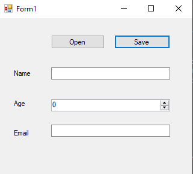

# 87-editing-xml Snippets Code

## EditingXml example

### Program.cs

```c#
using System;
using System.Collections.Generic;
using System.ComponentModel;
using System.Data;
using System.Drawing;
using System.Linq;
using System.Text;
using System.Threading.Tasks;
using System.Windows.Forms;
using System.Xml;//Must be

namespace EditingXml
{
    public partial class Form1 : Form
    {
        public Form1()
        {
            InitializeComponent();
        }

        XmlDocument xDoc;
        string path;

        private void button1_Click(object sender, EventArgs e)
        {

            OpenFileDialog o = new OpenFileDialog();

            if (o.ShowDialog() == DialogResult.OK) {//if the user select

                path = o.FileName;
                xDoc = new XmlDocument();
                xDoc.Load(path);
                textBox1.Text = xDoc.SelectSingleNode("people/person/name").InnerText;
                numericUpDown1.Value =Convert.ToInt32(xDoc.SelectSingleNode("people/person/age").InnerText);
                textBox2.Text = xDoc.SelectSingleNode("people/person/email").InnerText;


            }
           

        }

        private void button2_Click(object sender, EventArgs e)
        {
            xDoc.SelectSingleNode("people/person/name").InnerText = textBox1.Text;
            xDoc.SelectSingleNode("people/person/age").InnerText = numericUpDown1.Value.ToString();//textbox can hold string value.
            xDoc.SelectSingleNode("people/person/email").InnerText = textBox2.Text;
            xDoc.Save(path);
            MessageBox.Show("Saved");
        }
    }
}


```

### Ouput



