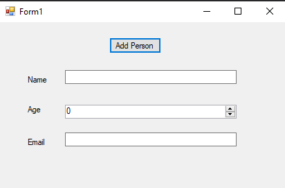

# 89-adding-notes-to-an-exiting-xml Snippets Code

## AddNotestoanExitingXML example

### Program.cs

```c#
using System;
using System.Collections.Generic;
using System.ComponentModel;
using System.Data;
using System.Drawing;
using System.Linq;
using System.Text;
using System.Threading.Tasks;
using System.Windows.Forms;
using System.Xml;

namespace AddNotestoanExitingXML
{
    public partial class Form1 : Form
    {
        public Form1()
        {
            InitializeComponent();
        }

        private void button1_Click(object sender, EventArgs e)
        {
            XmlDocument doc = new XmlDocument();
            doc.Load("C:\\Users\\Joker Hacker\\Desktop\\ExampleXML.xml");
            XmlNode person = doc.CreateElement("person");//<person> </person>
            XmlNode name = doc.CreateElement("name");
            name.InnerText = textBox1.Text;
            person.AppendChild(name);
            doc.DocumentElement.AppendChild(person);//added to the root node.

            XmlNode age = doc.CreateElement("age");
            age.InnerText = Convert.ToString(numericUpDown1.Value);
            person.AppendChild(age);

            XmlNode email = doc.CreateElement("email");
            email.InnerText = textBox2.Text;

            person.AppendChild(email);

            doc.Save("C:\\Users\\Joker Hacker\\Desktop\\ExampleXML.xml");


        }
    }
}


```

### Ouput



