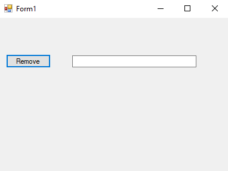
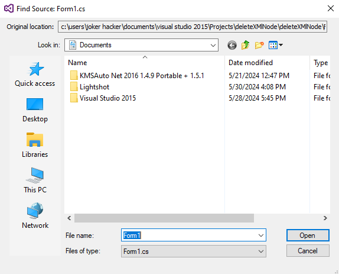
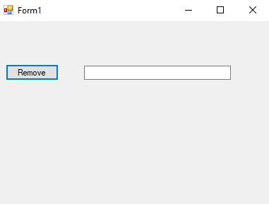

# 90-remove-xml-nodes Snippets Code

## 1-remove-notes example

### Program.cs

```c#

using System;
using System.Collections.Generic;
using System.ComponentModel;
using System.Data;
using System.Drawing;
using System.Linq;
using System.Text;
using System.Threading.Tasks;
using System.Windows.Forms;
using System.Xml;

namespace deleteXMlNode
{
    public partial class Form1 : Form
    {
        public Form1()
        {
            InitializeComponent();
        }

        private void button1_Click(object sender, EventArgs e)
        {

            XmlDocument xDoc = new XmlDocument();
            xDoc.Load("C:\\Users\\Joker Hacker\\Desktop\\ExampleXML.xml");

            foreach (XmlNode xNode in xDoc.SelectNodes("people/person")) {


                if (xNode.SelectSingleNode("name").InnerText == textBox1.Text) {

                    xNode.RemoveAll();//This will remove all nodes thats besides it. This wont remove with the parent.
                }

                xDoc.Save("C:\\Users\\Joker Hacker\\Desktop\\ExampleXML.xml");

            }
            
        }
    }
}


```

### Ouput





## 2-remove-notes-with-parent example

### Program.cs

```c#

using System;
using System.Collections.Generic;
using System.ComponentModel;
using System.Data;
using System.Drawing;
using System.Linq;
using System.Text;
using System.Threading.Tasks;
using System.Windows.Forms;
using System.Xml;

namespace deleteXMlNode
{
    public partial class Form1 : Form
    {
        public Form1()
        {
            InitializeComponent();
        }

        private void button1_Click(object sender, EventArgs e)
        {

            XmlDocument xDoc = new XmlDocument();
            xDoc.Load("C:\\Users\\Joker Hacker\\Desktop\\ExampleXML.xml");

            foreach (XmlNode xNode in xDoc.SelectNodes("people/person")) {


                if (xNode.SelectSingleNode("name").InnerText == textBox1.Text) {

                    xNode.ParentNode.RemoveChild(xNode);//go to the parent node and remove the child node of the xNode
                }

                xDoc.Save("C:\\Users\\Joker Hacker\\Desktop\\ExampleXML.xml");

            }
            
        }
    }
}


```

### Ouput




