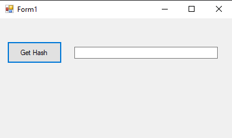
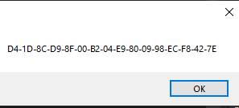

# 91-md5 Snippets Code

## MD5Example example

### Program.cs

```c#
using System;
using System.Collections.Generic;
using System.ComponentModel;
using System.Data;
using System.Drawing;
using System.Linq;
using System.Text;
using System.Threading.Tasks;
using System.Windows.Forms;
using System.Security.Cryptography;//must be

namespace MD5Example
{
    public partial class Form1 : Form
    {
        public Form1()
        {
            InitializeComponent();
        }

        private void button1_Click(object sender, EventArgs e)
        {
            MD5CryptoServiceProvider md5 = new MD5CryptoServiceProvider();
            UTF8Encoding utf8 = new UTF8Encoding();
            MessageBox.Show(BitConverter.ToString(md5.ComputeHash(utf8.GetBytes(textBox1.Text))));


        }
    }
}


```

### Ouput



