# 96-graphics Snippets Code

## 1-basic-shapes Example

### Program.cs

```c#
using System;
using System.Collections.Generic;
using System.ComponentModel;
using System.Data;
using System.Drawing;
using System.Linq;
using System.Text;
using System.Threading.Tasks;
using System.Windows.Forms;

namespace drawshape
{
    public partial class Form1 : Form
    {
        public Form1()
        {
            InitializeComponent();
        }

        private void panel1_Paint(object sender, PaintEventArgs e)
        {
           
             

        }

        private void panel1_Click(object sender, EventArgs e)
        {
            SolidBrush so = new SolidBrush(Color.Green); // i have created a solidBrush with green color.
            Graphics g = panel1.CreateGraphics();  // we have created an graphics in the panel.
            g.FillRectangle(so, 20, 20, 50, 50); //20 20 is the coordiates 50 50 is the width and height.

        }
    }
}


```

### Ouput

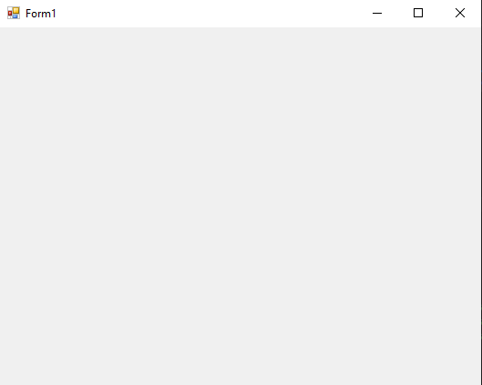


## 2-fill-pie Example

### Program.cs

```c#

using System;
using System.Collections.Generic;
using System.ComponentModel;
using System.Data;
using System.Drawing;
using System.Linq;
using System.Text;
using System.Threading.Tasks;
using System.Windows.Forms;

namespace drawshape
{
    public partial class Form1 : Form
    {
        public Form1()
        {
            InitializeComponent();
        }

        private void panel1_Paint(object sender, PaintEventArgs e)
        {
           
             

        }

        private void panel1_Click(object sender, EventArgs e)
        {
            SolidBrush so = new SolidBrush(Color.Blue);
            Graphics g = panel1.CreateGraphics();
            g.FillPie(so,20, 20, 50, 50, 0, 270);
            //20 20 are the cooridates.
            //50 50 are the width and height
            //pie is 360 deg.
            //0 is the starting angle means if we give 90 that will rotate 90 deg.
            //180 is sweep angle.


        }
    }
}


```

### Ouput


## 3-fill-polygon Example

### Program.cs

```c#
using System;
using System.Collections.Generic;
using System.ComponentModel;
using System.Data;
using System.Drawing;
using System.Linq;
using System.Text;
using System.Threading.Tasks;
using System.Windows.Forms;

namespace drawshape
{
    public partial class Form1 : Form
    {
        public Form1()
        {
            InitializeComponent();
        }

        private void panel1_Paint(object sender, PaintEventArgs e)
        {
           
             

        }

        private void panel1_Click(object sender, EventArgs e)
        {
            SolidBrush so = new SolidBrush(Color.Blue);
            Graphics g = panel1.CreateGraphics();
            Point[] points = { new Point(0, 20), new Point(0, 0), new Point(20, 0) };
            g.FillPolygon(so, points);

            //We can draw any shape in Polygon we must use Point.

        }
    }
}

```

### Ouput


## 4-draw-rectangle-with-pen Example

### Program.cs

```c#
using System;
using System.Collections.Generic;
using System.ComponentModel;
using System.Data;
using System.Drawing;
using System.Linq;
using System.Text;
using System.Threading.Tasks;
using System.Windows.Forms;

namespace drawshape
{
    public partial class Form1 : Form
    {
        public Form1()
        {
            InitializeComponent();
        }

        private void panel1_Paint(object sender, PaintEventArgs e)
        {
           
             

        }

        private void panel1_Click(object sender, EventArgs e)
        {
            Pen pen = new Pen(Color.Green,3);// 3 is the thick of the pen tool.
            Graphics g = panel1.CreateGraphics();
            g.DrawRectangle(pen,20, 20, 50, 50);

            //unlike brash pen only draw the outline.

        }
    }
}

```

### Ouput

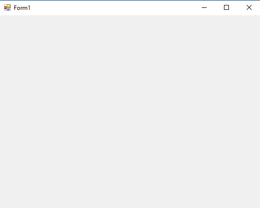

## 6-draw-polygon-with-pen Example

### Program.cs

```c#
using System;
using System.Collections.Generic;
using System.ComponentModel;
using System.Data;
using System.Drawing;
using System.Linq;
using System.Text;
using System.Threading.Tasks;
using System.Windows.Forms;

namespace drawshape
{
    public partial class Form1 : Form
    {
        public Form1()
        {
            InitializeComponent();
        }

        private void panel1_Paint(object sender, PaintEventArgs e)
        {
           
             

        }

        private void panel1_Click(object sender, EventArgs e)
        {
            Pen pen = new Pen(Color.Red,4);// 4 is the thick of the pen tool.
            Graphics g = panel1.CreateGraphics();
            Point[] ponts = { new Point(0, 20), new Point(0, 0), new Point(20, 0) };
            g.DrawPolygon(pen,ponts);

            //unlike brash pen only draw the outline.
            //if we use pen need to use the word Draw.
            //But in brash we must use Fill.

        }
    }
}

```

### Ouput

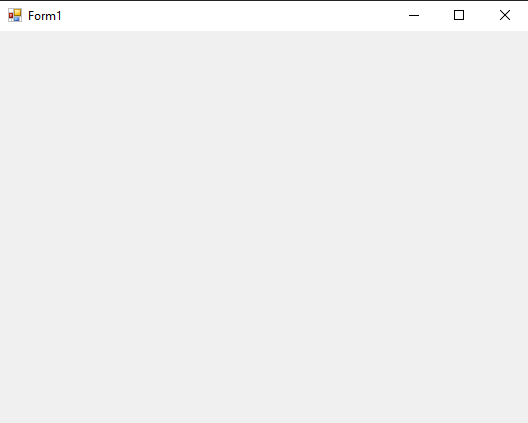


## 7-drawarc-with-pen Example

### Program.cs

```c#
using System;
using System.Collections.Generic;
using System.ComponentModel;
using System.Data;
using System.Drawing;
using System.Linq;
using System.Text;
using System.Threading.Tasks;
using System.Windows.Forms;

namespace drawshape
{
    public partial class Form1 : Form
    {
        public Form1()
        {
            InitializeComponent();
        }

        private void panel1_Paint(object sender, PaintEventArgs e)
        {
           
             

        }

        private void panel1_Click(object sender, EventArgs e)
        {
            Pen pen = new Pen(Color.Red,2);
            Graphics g = panel1.CreateGraphics();
            g.DrawArc(pen,20, 20, 100, 100, 0, 360);
            
            //360 is the full with of the arc/
            //20 20 are the coordinates.
            //100 100 are the width and height.
            //0 is the starting angle 
            //180 is the sweepAngle.

           

        }
    }
}

```

### Ouput

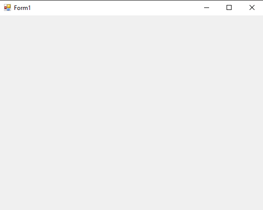


## 8-draw-bezier-with-pen Example

### Program.cs

```c#
using System;
using System.Collections.Generic;
using System.ComponentModel;
using System.Data;
using System.Drawing;
using System.Linq;
using System.Text;
using System.Threading.Tasks;
using System.Windows.Forms;

namespace drawshape
{
    public partial class Form1 : Form
    {
        public Form1()
        {
            InitializeComponent();
        }

        private void panel1_Paint(object sender, PaintEventArgs e)
        {
           
             

        }

        private void panel1_Click(object sender, EventArgs e)
        {
            Pen pen = new Pen(Color.Red,2);
            Graphics g = panel1.CreateGraphics();
            g.DrawBezier(pen,new Point(20,30),new Point(60,70),new Point(90,40),new Point(110,63));
            
        }
    }
}

```

### Ouput


## 9-drawline-with-pen Example

### Program.cs

```c#
using System;
using System.Collections.Generic;
using System.ComponentModel;
using System.Data;
using System.Drawing;
using System.Linq;
using System.Text;
using System.Threading.Tasks;
using System.Windows.Forms;

namespace drawshape
{
    public partial class Form1 : Form
    {
        public Form1()
        {
            InitializeComponent();
        }

        private void panel1_Paint(object sender, PaintEventArgs e)
        {
           
             

        }

        private void panel1_Click(object sender, EventArgs e)
        {
            Pen pen = new Pen(Color.Red,2);
            Graphics g = panel1.CreateGraphics();
            g.DrawLine(pen,new Point(20,20),new Point(100,100));
            //starting and ending points.
            
        }

        private void Form1_Load(object sender, EventArgs e)
        {

        }
    }
}


```

### Ouput

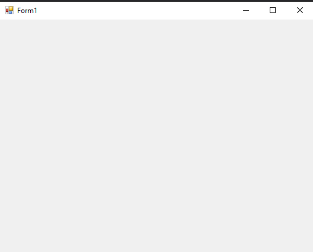

## 10-draw-stirng Example

### Program.cs

```c#
using System;
using System.Collections.Generic;
using System.ComponentModel;
using System.Data;
using System.Drawing;
using System.Linq;
using System.Text;
using System.Threading.Tasks;
using System.Windows.Forms;

namespace drawshape
{
    public partial class Form1 : Form
    {
        public Form1()
        {
            InitializeComponent();
        }

        private void panel1_Paint(object sender, PaintEventArgs e)
        {
           
             

        }

        private void panel1_Click(object sender, EventArgs e)
        {

            SolidBrush so = new SolidBrush(Color.Blue);
            Graphics g =panel1.CreateGraphics();
            FontFamily ff = new FontFamily("Arial");//we have created a fontFamliy.
            System.Drawing.Font font = new System.Drawing.Font(ff, 50, FontStyle.Bold);
            g.DrawString("Guna", font,so,new PointF(20,20));

            
        }
    }
}


```

### Ouput

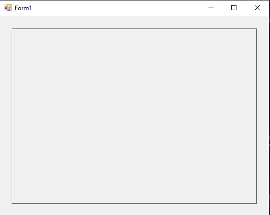

## 11-linear-gradient-brush Example

### Program.cs

```c#

using System;
using System.Collections.Generic;
using System.ComponentModel;
using System.Data;
using System.Drawing;
using System.Linq;
using System.Text;
using System.Threading.Tasks;
using System.Windows.Forms;
using System.Drawing.Drawing2D;

namespace drawshape
{
    public partial class Form1 : Form
    {
        public Form1()
        {
            InitializeComponent();
        }

        private void panel1_Paint(object sender, PaintEventArgs e)
        {
           
             

        }

        private void panel1_Click(object sender, EventArgs e)
        {


            LinearGradientBrush lgb = new LinearGradientBrush(new Point(20,20),new Point(70,20),Color.Red,Color.Blue);
            Graphics g = panel1.CreateGraphics();
            g.FillRectangle(lgb, 20, 20, 50, 50);

            
        }
    }
}

```

### Ouput

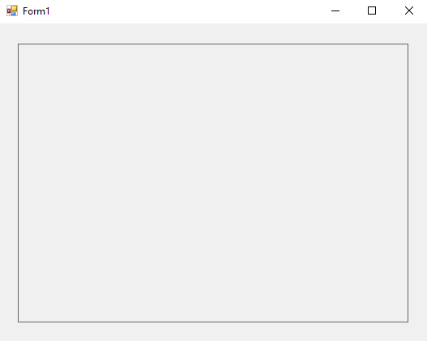


## 12-linear-gradient-brush-with-color-blend Example

### Program.cs

```c#
using System;
using System.Collections.Generic;
using System.ComponentModel;
using System.Data;
using System.Drawing;
using System.Linq;
using System.Text;
using System.Threading.Tasks;
using System.Windows.Forms;
using System.Drawing.Drawing2D;

namespace drawshape
{
    public partial class Form1 : Form
    {
        public Form1()
        {
            InitializeComponent();
        }

        private void panel1_Paint(object sender, PaintEventArgs e)
        {
           
             

        }

        private void panel1_Click(object sender, EventArgs e)
        {


            LinearGradientBrush lgb = new LinearGradientBrush(new Point(20,20),new Point(70,20),Color.Red,Color.Blue);
            Graphics g = panel1.CreateGraphics();
            ColorBlend cb = new ColorBlend();
            cb.Colors = new Color[]{Color.Black,Color.Blue,Color.SkyBlue,Color.White };//Colors for the Gradeint.
            cb.Positions = new float[] { 0, .33f , .66f, 1f };//Position for Colors.
            lgb.InterpolationColors = cb;
            g.FillRectangle(lgb,20,20,50,50);
            


            
        }
    }
}

```

### Ouput

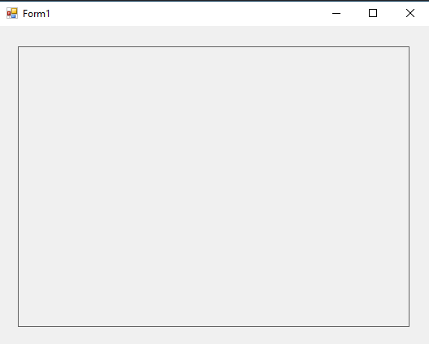


## 13-graphic-path Example

### Program.cs

```c#
using System;
using System.Collections.Generic;
using System.ComponentModel;
using System.Data;
using System.Drawing;
using System.Linq;
using System.Text;
using System.Threading.Tasks;
using System.Windows.Forms;
using System.Drawing.Drawing2D;

namespace drawshape
{
    public partial class Form1 : Form
    {
        public Form1()
        {
            InitializeComponent();
        }

        private void panel1_Paint(object sender, PaintEventArgs e)
        {
           
             

        }

        private void panel1_Click(object sender, EventArgs e)
        {


            GraphicsPath gp = new GraphicsPath();
            gp.AddEllipse(20, 20, 100, 100);
            PathGradientBrush pgb = new PathGradientBrush(gp);
            pgb.CenterColor = Color.White;//                 This is the Center Color.
            pgb.SurroundColors = new Color[] { Color.Black };//This is the SurroundColors;
            Graphics g = panel1.CreateGraphics();
            g.FillEllipse(pgb,20, 20, 100, 100);
            
        }
    }
}

```

### Ouput

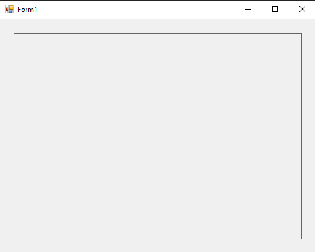

## 14-rectangle-gradient Example

### Program.cs

```c#
using System;
using System.Collections.Generic;
using System.ComponentModel;
using System.Data;
using System.Drawing;
using System.Linq;
using System.Text;
using System.Threading.Tasks;
using System.Windows.Forms;
using System.Drawing.Drawing2D;

namespace drawshape
{
    public partial class Form1 : Form
    {
        public Form1()
        {
            InitializeComponent();
        }

        private void panel1_Paint(object sender, PaintEventArgs e)
        {
           
             

        }

        private void panel1_Click(object sender, EventArgs e)
        {
            
            GraphicsPath gp = new GraphicsPath();
            Rectangle r = new Rectangle(20, 20, 100, 50);//we have creared a rectangle.
            gp.AddRectangle(r);                          //we added that rectangle.
            PathGradientBrush pgb = new PathGradientBrush(gp);
            pgb.CenterColor = Color.White;//                 This is the Center Color.
            pgb.SurroundColors = new Color[] { Color.Black };//This is the SurroundColors;
            Graphics g = panel1.CreateGraphics();
            g.FillRectangle(pgb,r);
            
        }
    }
}

```

### Ouput

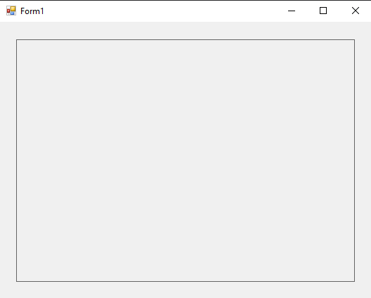

## 15-polygon-gradient Example

### Program.cs

```c#
using System;
using System.Collections.Generic;
using System.ComponentModel;
using System.Data;
using System.Drawing;
using System.Linq;
using System.Text;
using System.Threading.Tasks;
using System.Windows.Forms;
using System.Drawing.Drawing2D;

namespace drawshape
{
    public partial class Form1 : Form
    {
        public Form1()
        {
            InitializeComponent();
        }

        private void panel1_Paint(object sender, PaintEventArgs e)
        {
           
             

        }

        private void panel1_Click(object sender, EventArgs e)
        {
            
            GraphicsPath gp = new GraphicsPath();
            Point[] Points = {new Point(20,20),new Point(20,70),new Point(70,20)};//points array for polygon.
            gp.AddPolygon(Points);// added a Polygon
            PathGradientBrush pgb = new PathGradientBrush(gp);
            pgb.CenterColor = Color.White;//                 This is the Center Color.
            pgb.SurroundColors = new Color[] { Color.Black };//This is the SurroundColors;
            Graphics g = panel1.CreateGraphics();
            g.FillPolygon(pgb, Points);
            
        }
    }
}

```

### Ouput

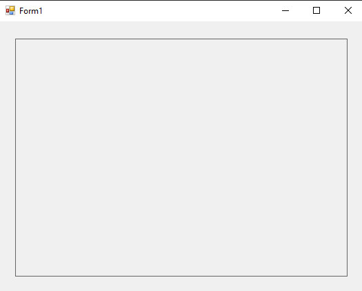