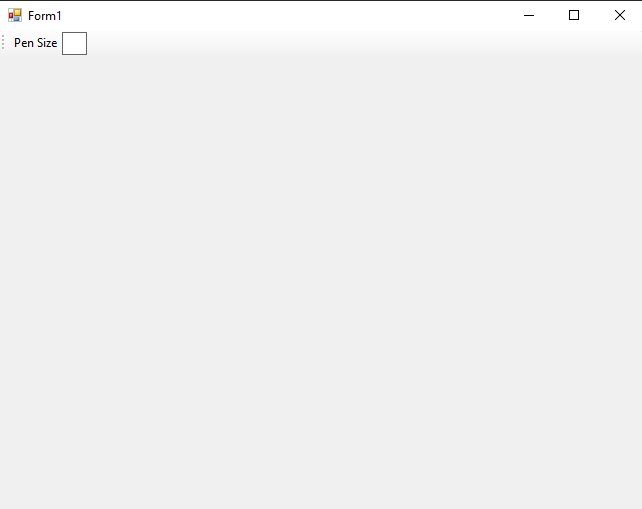
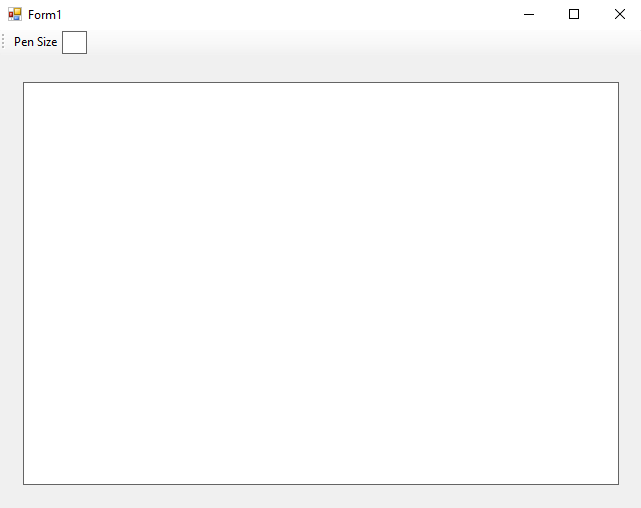
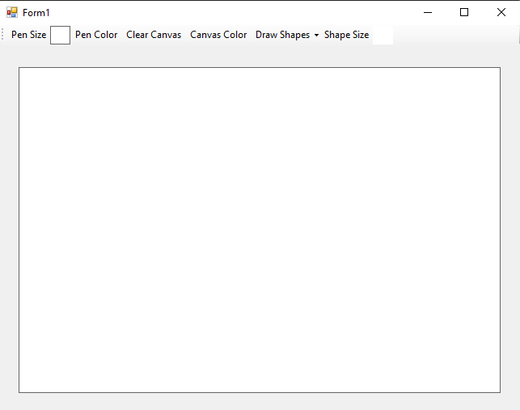
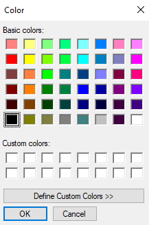

# 97-paint-application Snippets Code

## 1-first-ver example

### Program.cs

```c#
using System;
using System.Collections.Generic;
using System.ComponentModel;
using System.Data;
using System.Drawing;
using System.Linq;
using System.Text;
using System.Threading.Tasks;
using System.Windows.Forms;

namespace paintApplicationWin
{
    public partial class Form1 : Form
    {
        public Form1()
        {
            InitializeComponent();
            g = panel1.CreateGraphics();//we need to this all over the place.
        }

        private void toolStripLabel1_Click(object sender, EventArgs e)
        {

        }

        bool canPaint = false;
        Graphics g;

        private void panel1_MouseDown(object sender, MouseEventArgs e)//When the user mouse is pressing down.
        {

            canPaint = true;//Set  to true.
        }

        private void panel1_MouseUp(object sender, MouseEventArgs e)//When the mouse is up
        {
            canPaint = false;//Set to false.
        }

        private void panel1_MouseMove(object sender, MouseEventArgs e)
        {
            if (canPaint) {//when the mouse is pressing down it would be true.

                SolidBrush so = new SolidBrush(Color.Black);
                g.FillEllipse(so, e.X, e.Y, Convert.ToInt32(toolStripTextBox1.Text),Convert.ToInt32(toolStripTextBox1.Text));

                //e.Y and e.Y are the coordinates.That will change dynamically.
                //Then we convert the value form the toolStripTextBox1 to int.That is the size.


            }
        }
    }
}


//This is program draw a cricle everytime when the mouse is down 

```

### Ouput



## 2-pen-tool example

### Program.cs

```c#
using System;
using System.Collections.Generic;
using System.ComponentModel;
using System.Data;
using System.Drawing;
using System.Linq;
using System.Text;
using System.Threading.Tasks;
using System.Windows.Forms;

namespace paintApplicationWin
{
    public partial class Form1 : Form
    {
        public Form1()
        {
            InitializeComponent();
            g = panel1.CreateGraphics();//we need to this all over the place.
        }

        private void toolStripLabel1_Click(object sender, EventArgs e)
        {

        }

        bool canPaint = false;
        Graphics g;

        private void panel1_MouseDown(object sender, MouseEventArgs e)//When the user mouse is pressing down.
        {

            canPaint = true;//Set  to true.
        }

        private void panel1_MouseUp(object sender, MouseEventArgs e)//When the mouse is up
        {
            canPaint = false;//Set to false.
            prevX = null;
            prevY = null;
        }

        int? prevX = null;//int? can be stroed null value.
        int? prevY = null;
        
        private void panel1_MouseMove(object sender, MouseEventArgs e)
        {
            if (canPaint) {//when the mouse is pressing down it would be true.

                Pen pen = new Pen(Color.Black, float.Parse(toolStripTextBox1.Text));//I have converted the size to float.
                g.DrawLine(pen,new Point(prevX ?? e.X, prevY ?? e.Y), new Point(e.X, e.Y));
                //if prevX or prevY has previous Coordiates that will start from there. and end at the current Coorinates.
                //or start from the current Coodinates.
                prevX = e.X;//after stop drawing here the coordinate will be stored
                prevY = e.Y;
                
            }
        }
    }
}


```

### Ouput




## 3-final-ver example

### Program.cs

```c#
using System;
using System.Collections.Generic;
using System.ComponentModel;
using System.Data;
using System.Drawing;
using System.Linq;
using System.Text;
using System.Threading.Tasks;
using System.Windows.Forms;

namespace paintApplicationWin
{
    public partial class Form1 : Form
    {
        public Form1()
        {
            InitializeComponent();
            g = panel1.CreateGraphics();//we need to this all over the place.
        }

        private void toolStripLabel1_Click(object sender, EventArgs e)
        {

        }

        bool canPaint = false;
        Graphics g;

        private void panel1_MouseDown(object sender, MouseEventArgs e)//When the user mouse is pressing down.
        {

            canPaint = true;//Set  to true.

            if (canDrawSqaure)
            {

                SolidBrush so = new SolidBrush(toolStripButton1.ForeColor);
                g.FillRectangle(so, e.X, e.Y, Convert.ToInt32(toolStripTextBox2.Text), Convert.ToInt32(toolStripTextBox2.Text));
                canDrawSqaure = false;//after drawing set to false.
                canPaint = false;


            }
            else if (canDrawRectangle)
            {

                SolidBrush so = new SolidBrush(toolStripButton1.ForeColor);
                g.FillRectangle(so, e.X, e.Y, Convert.ToInt32(toolStripTextBox2.Text) * 2, Convert.ToInt32(toolStripTextBox2.Text));
                canDrawRectangle = false;
                canPaint = false;

            }
            else if (canDrawCricle) {

                SolidBrush so = new SolidBrush(toolStripButton1.ForeColor);
                g.FillPie(so, e.X, e.Y,Convert.ToInt32(toolStripTextBox2.Text),Convert.ToInt32(toolStripTextBox2.Text),0,360);
                canDrawCricle = false;
                canPaint = false;

            }
            
        }

        private void panel1_MouseUp(object sender, MouseEventArgs e)//When the mouse is up
        {
            canPaint = false;//Set to false.
            prevX = null;
            prevY = null;
        }

        int? prevX = null;//int? can be stroed null value.
        int? prevY = null;
        
        private void panel1_MouseMove(object sender, MouseEventArgs e)
        {
            if (canPaint) {//when the mouse is pressing down it would be true.

                Pen pen = new Pen(toolStripButton1.ForeColor, float.Parse(toolStripTextBox1.Text));//I am using the toolStripButton1 color.
                g.DrawLine(pen,new Point(prevX ?? e.X, prevY ?? e.Y), new Point(e.X, e.Y));
               

                prevX = e.X;
                prevY = e.Y;
                
            }
        }

        private void toolStripButton1_Click(object sender, EventArgs e)
        {
            ColorDialog cd = new ColorDialog();

            if (cd.ShowDialog() == DialogResult.OK) {

                toolStripButton1.ForeColor = cd.Color;

            }
        }

        private void toolStripButton2_Click(object sender, EventArgs e)
        {

            g.Clear(panel1.BackColor);
        }

        private void toolStripButton3_Click(object sender, EventArgs e)
        {
            ColorDialog cd = new ColorDialog();
            if (cd.ShowDialog() == DialogResult.OK) {

                toolStripButton3.ForeColor = cd.Color;
                panel1.BackColor = cd.Color;

            }
        }

        private void toolStripButton4_Click(object sender, EventArgs e)
        {

        }

        private void panel1_Paint(object sender, PaintEventArgs e)
        {

        }

        bool canDrawSqaure = false;

        private void drawShapeToolStripMenuItem_Click(object sender, EventArgs e)
        {

            canDrawSqaure = true;

        }

        bool canDrawRectangle = false;

        private void rectangleToolStripMenuItem_Click(object sender, EventArgs e)
        {

            canDrawRectangle = true;

        }

        bool canDrawCricle = false;

        private void cricleToolStripMenuItem_Click(object sender, EventArgs e)
        {

            canDrawCricle = true;

        }

        private void panel1_MouseEnter(object sender, EventArgs e)
        {
            
        }

        private void panel1_DragEnter(object sender, DragEventArgs e)
        {
            e.Effect = DragDropEffects.All;
        }

        private void panel1_DragDrop(object sender, DragEventArgs e)
        {
            string[] imagePath = (string[])e.Data.GetData(DataFormats.FileDrop);
            //we convert the drao files into string.s

            foreach (string path in imagePath)
            {
                g.DrawImage(Image.FromFile(path), new Point(0, 0));
                
            }
        }
    }
}


 

```

### Ouput





