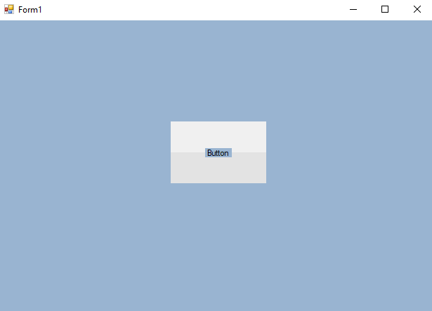
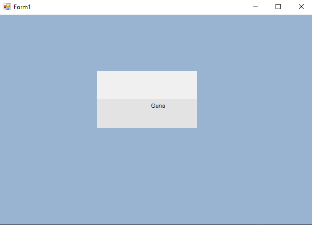
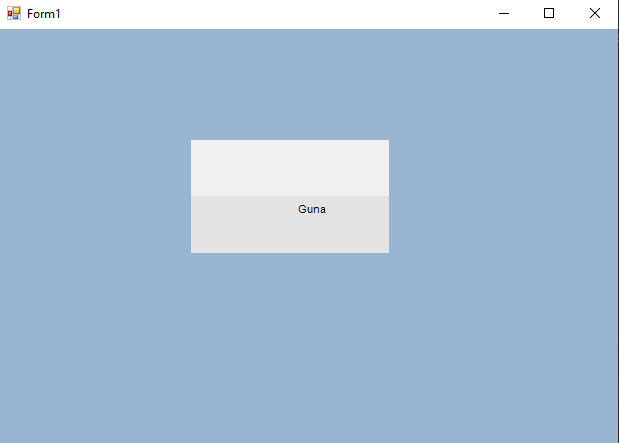

# 98-making-custom-control Snippets Code

## 1-my-button example

### Program.cs

```c#
using System;
using System.Collections.Generic;
using System.ComponentModel;
using System.Data;
using System.Drawing;
using System.Linq;
using System.Text;
using System.Threading.Tasks;
using System.Windows.Forms;

namespace CreateOwnControler
{
    public partial class Form1 : Form
    {
        public Form1()
        {
            InitializeComponent();
        }

        private void myButton1_Load(object sender, EventArgs e)
        {
            
        }

        private void myButton1_Load_1(object sender, EventArgs e)
        {

        }
    }
}


```

### Ouput



## 2-my-button-with-drawstring example

### Program.cs

```c#
using System;
using System.Collections.Generic;
using System.ComponentModel;
using System.Data;
using System.Drawing;
using System.Linq;
using System.Text;
using System.Threading.Tasks;
using System.Windows.Forms;

namespace CreateOwnControler
{
    public partial class Form1 : Form
    {
        public Form1()
        {
            InitializeComponent();
        }

        private void myButton1_Load(object sender, EventArgs e)
        {
            
        }

        private void myButton1_Load_1(object sender, EventArgs e)
        {

        }
    }
}


```

### Ouput




## 3-mouse-hover example

### Program.cs

```c#
using System;
using System.Collections.Generic;
using System.ComponentModel;
using System.Data;
using System.Drawing;
using System.Linq;
using System.Text;
using System.Threading.Tasks;
using System.Windows.Forms;

namespace CreateOwnControler
{
    public partial class Form1 : Form
    {
        public Form1()
        {
            InitializeComponent();
        }

        private void myButton1_Load(object sender, EventArgs e)
        {
            
        }

        private void myButton1_Load_1(object sender, EventArgs e)
        {

        }

        private void myButton1_MouseHover(object sender, EventArgs e)
        {

            
        }
    }
}

 

```

### Ouput




