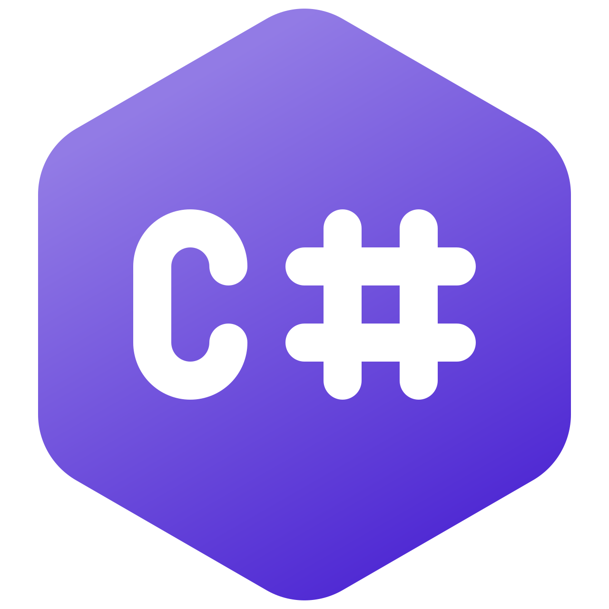

# C# Snippets

## Introduction

C# is a powerful programming language developed by Microsoft, known for its versatility in building applications across desktop, web, mobile, and cloud platforms. With a focus on object-oriented programming and integration with the .NET framework, C# offers a robust and scalable solution for developers. 

Its strong typing system enhances code safety, and it is commonly used with frameworks like ASP.NET for web development. C# finds applications in game development (Unity), Windows desktop apps, and cloud services, making it a versatile choice within the Microsoft ecosystem.

## Learning Resources

1. [Console Applications](1-console-applications/)
2. [Windows Applications](2-windows-applications/)

## Social Links

- [Linkedin](https://www.linkedin.com/in/gunarakulangunaretnam)
- [Facebook](https://www.facebook.com/gunarakulangunaretnam)
- [Instagram](https://www.instagram.com/gunarakulangunaretnam)
- [Twitter](https://twitter.com/gunarakulangr)
- [Kaggle](https://www.kaggle.com/gunarakulangr)
- [TikTok](https://www.tiktok.com/@gunarakulangunaretnam)
- [Youtube](https://www.youtube.com/channel/UCjMOdgHFAjAdBKiqV8y2Tww)

